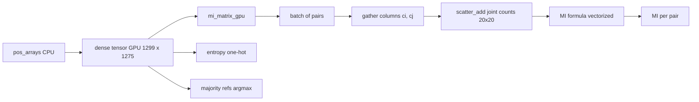

# 02. coevolution_gpu.py - The GPU Engine

## What the Program Does

`coevolution_gpu.py` implements the heavy numerical kernels on the NVIDIA A100 GPU using the PyTorch library (CUDA backend). It provides:

1. `dense_to_gpu` - builds a dense integer tensor of shape (n_sequences, max_positions) on the GPU.
2. `majority_refs_gpu` - computes the most common amino acid per position.
3. `compute_entropy_gpu` - Shannon entropy for all positions in one vectorized call.
4. `mi_matrix_gpu` - mutual information for an arbitrary list of position pairs, computed in batches.
5. `coupling_matrix_gpu` - coupling J = ln(P / P_expected) for one pair.
6. `h1_adjacency_gpu` - the H1 Gray-adjacency statistic.
7. `all_pairs` - enumerates position pairs.

The reason for the GPU is speed. The full MI matrix for 1,276 positions is 813,450 pairs. With the original pure Python Counter implementation this took more than 20 minutes and timed out. On the GPU the same computation takes about 1.6 seconds. That is roughly a 750x speedup.

## What Data It Looks At

It receives position arrays (already encoded 0 to 19) and moves them to the GPU as one dense tensor of shape (1,299, 1,275). The MI kernel then works on batches of position pairs. Each batch extracts two columns of the tensor (the residues at positions i and j for every sequence), builds the joint 20 x 20 count table, and computes MI for all pairs in the batch simultaneously.



## The MI Kernel Step by Step

For one position pair (i, j):

1. Extract `ci` = residues at position i for all sequences, `cj` = residues at position j.
2. Keep only valid pairs (both codes >= 0).
3. Flatten each pair into a single integer `flat = ci * 20 + cj` (0 to 399).
4. Use `scatter_add` to count how many sequences have each of the 400 combinations. This produces the joint 20 x 20 count matrix.
5. Compute marginals (row sums and column sums).
6. Compute MI with the vectorized formula.

Because the counting is a single scatter operation and the MI formula is a few tensor operations, a batch of thousands of pairs is processed in one GPU call.

## Formulas

### Batched MI

For a batch of P pairs:

```
joint[b, a, c] = count of sequences with residue a at pair's first position and c at second
total[b] = sum over a, c of joint[b, a, c]
p[b, a, c] = joint[b, a, c] / total[b]
pi[b, a] = sum over c of p[b, a, c]
pj[b, c] = sum over a of p[b, a, c]
MI[b] = sum over a, c where p > 0 of p[b,a,c] * log2( p[b,a,c] / (pi[b,a] * pj[b,c]) )
```

### Entropy (all positions at once)

The GPU builds a one-hot tensor: for each sequence and position, a vector of 20 zeros with a single 1 at the observed amino acid. Summing over sequences gives counts per position. Then:

```
p[pos, a] = count[pos, a] / total[pos]
H[pos] = - sum over a of p[pos, a] * log2(p[pos, a])
```

### H1 Gray adjacency

For consecutive residues (position i and i+1), compute Gray codes g(x) = x XOR (x >> 1) and count pairs with Hamming distance 1:

```
H1 ratio = (number of consecutive pairs with Hamming distance 1) / (total consecutive pairs)
```

## Worked Example: MI(372, 401) on GPU

The pair (372, 401) is the strongest MI pair in the dataset. The GPU kernel:

1. Extracts column 372 (residues at position 372 across all 1,299 sequences) and column 401.
2. Counts the joint distribution. The top entries are (A, N) with 814 sequences, (T, D) with 260, (K, V) with 114.
3. Computes marginals. P(372 = A) is roughly 0.63, P(401 = N) is roughly 0.63.
4. The product P(372=A) * P(401=N) is about 0.40, but the observed joint P(A, N) = 0.6266. The ratio 0.6266 / 0.40 is about 1.57, so log2 of it contributes about 0.65 bits; the sum over all pairs gives MI = 1.5917 bits.

## Results

- Full MI matrix: 813,450 pairs computed in 1.6 seconds.
- Max MI = 1.5917 at (372, 401).
- Mean MI over non-zero pairs = 0.6655 bits.
- 106,626 pairs with MI > 1.0.
- Majority refs and entropy for all 1,275 positions in under 0.1 seconds.


## Inference

The GPU engine makes full-length analysis feasible. The inference is that all statistical quantities (MI, entropy, coupling) are identical in value to their CPU counterparts but computed 750x faster, which is what allows the full 813,450-pair matrix to be analyzed in seconds. GPU acceleration is an enabler, not a change of science.

## Scholar Questions and Answers

**Q: Why is the GPU so much faster?**
A: Three reasons. First, the joint counting is a single scatter-add on the GPU instead of a Python loop over 1,299 sequences per pair. Second, pairs are processed in batches of thousands, amortizing kernel launch overhead. Third, the MI arithmetic is vectorized tensor operations executed by highly optimized CUDA kernels.

**Q: Is the result identical to the CPU result?**
A: Yes for practical purposes. The counting is exact (integer scatter). The MI arithmetic uses double precision on the GPU. The max MI value 1.5917 matches the CPU-computed value in `create_mi_heatmap.py` exactly.

**Q: Does the GPU help the Boolean minimization?**
A: No. Quine-McCluskey is a combinatorial algorithm with irregular control flow; it runs on CPU. The GPU accelerates the counting and statistical parts (MI, entropy, coupling), which are the bottleneck at full length.
