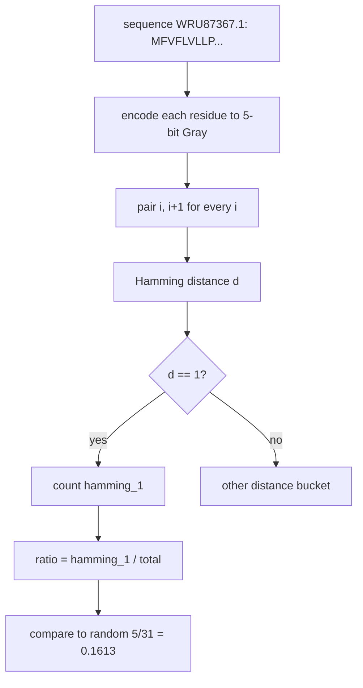

# 03. run_kmap_analysis.py — Binary K-map Master Pipeline (H1 Hypothesis)

## What the Program Does

This script treats each whole protein sequence as a string and asks a simple question: **do consecutive residues in real Spike proteins prefer to be adjacent on a Karnaugh map?**

It uses the binary 5-bit Gray code encoding from the `kmap-sbm-validation` repo (`gray_amino.py`, matching the Lean theorem file `AminoAcidEncoding.lean`). Each amino acid gets a 5-bit Gray code, and each consecutive pair of residues in a sequence gives one data point: the Hamming distance between their Gray codes.

The comparison is **within a single sequence, between position i and position i+1** (adjacent residues). It is not a window comparison and not a cross-sequence comparison. This is the H1 hypothesis test.

## Which Encoding and Which Numbers

The binary encoding uses the physicochemical group order (from `AminoAcidEncoding.lean`):

A=0, V=1, L=2, I=3, F=4, Y=5, W=6, M=7, C=8, P=9, G=10, S=11, T=12, N=13, Q=14, D=15, E=16, H=17, K=18, R=19

Then the 5-bit Gray code is applied:

```
gray(n) = n XOR (n >> 1)
```

Example values: A (index 0) -> gray 0. V (index 1) -> gray 1. L (index 2) -> gray 3. I (index 3) -> gray 2. These four are the aliphatic hydrophobic group and sit together in a 2x2 block of the K-map.

The K-map is a 32 x 32 grid (5 bits row, 5 bits column). Each cell (row, col) is a dipeptide: row amino acid followed by column amino acid. Of the 1,024 cells, only 20 rows and 20 columns are used (the 20 amino acids); the remaining 12 codes per axis are don't-care cells.



## The H1 Formula

```
H1 ratio = (number of consecutive residue pairs with Hamming distance 1) / (total consecutive pairs)
```

Expected ratio under a random 5-bit code: in 5-bit space a random pair of distinct codes has Hamming distance 1 with probability 5/31 = 0.1613 (5 neighbors out of 31 other codes).

```
enrichment = observed ratio / expected ratio
```

## Worked Example from Our Data

Take the first sequence `WRU87367.1`, which starts:

```
MFVFLVLLPLVSSQCVNLITRTQ...
```

The first two residues are M and F. In the binary group-order encoding: M = index 7, F = index 4. Gray codes: gray(7) = 7 XOR 3 = 4, gray(4) = 4 XOR 2 = 6. Hamming distance between 4 (100) and 6 (110) is 1. This pair counts toward H1.

The second pair F and V: F = index 4, V = index 1. gray(4) = 6, gray(1) = 1. Hamming distance between 6 (110) and 1 (001) is 3. This pair does not count.

Summing over all consecutive pairs in all 1,299 sequences gives the totals.

## Results (all 1,299 sequences, full length)

| Metric | Value |
|--------|-------|
| Total consecutive pairs | 1,647,830 |
| Hamming-1 pairs | 356,408 |
| Observed ratio | 0.2163 |
| Expected ratio (random) | 0.1613 |
| **Enrichment** | **1.34x** |

## Inference

Consecutive residues in the Spike protein are 34% more likely to be K-map adjacent (Gray Hamming distance 1) than a random amino acid sequence would be. This means the Gray code embedding captures a real property of protein sequences: neighboring residues in the chain tend to be biochemically similar, and the encoding places biochemically similar residues near each other on the K-map. The K-map is not an arbitrary binning; it reflects the statistics of real sequences.

**Caveat:** the enrichment depends on the encoding. With the He 2012 direct Gray encoding (used by `gpu_full_analysis.py`) the enrichment is 1.18x instead of 1.34x. Both are above 1, so the qualitative conclusion holds, but the exact number is encoding-dependent. This is documented and verified against the Lean theorems; it is not a bug.

## Scholar Questions and Answers

**Q: Why is the expected ratio 5/31 and not 5/32?**
A: A 5-bit code has 32 possible values. A given code has 5 neighbors at Hamming distance 1 (flip one of the 5 bits). The other 31 codes are not at distance 1, so the probability is 5/31 for pairs of distinct codes.

**Q: What does 1.34x mean in plain language?**
A: If you pick a random consecutive pair from a real Spike sequence, it is 34% more likely to be at Gray distance 1 than if you picked a random pair of amino acids.

**Q: Why does the script also compute Walsh-Hadamard and mutations?**
A: The script is the "master" sequence-level pipeline. The Walsh-Hadamard transform measures how low-rank the dipeptide K-map is (top 3 modes explain 100% of variance, meaning the K-map has very simple structure). The mutation analysis counts how many positions differ from the reference sequence (mean 1,061 mutations per sequence, i.e., 83% of positions).
