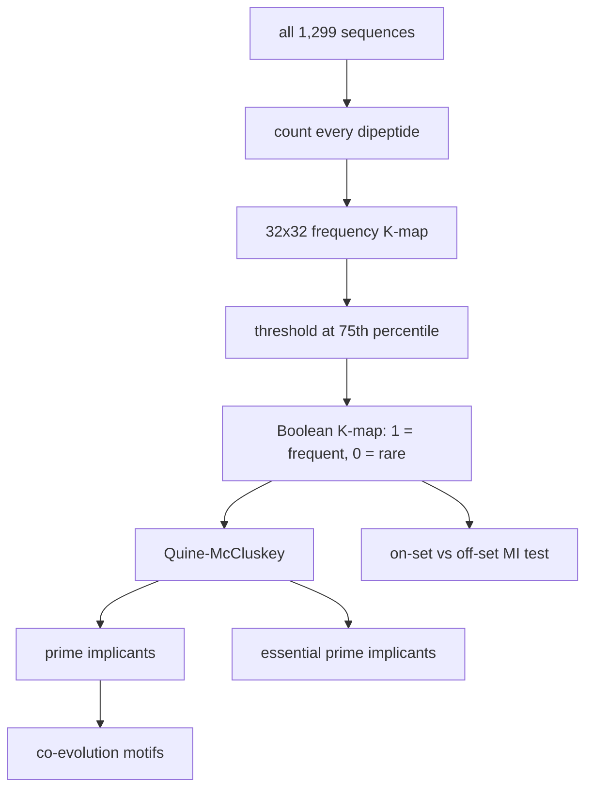

# 04. boolean_co-evolution.py - Binary K-map Boolean Minimization

## What the Program Does

This script asks: **can the entire protein's dipeptide landscape be compressed into a small set of Boolean rules?**

It builds one giant 32 x 32 binary K-map from ALL sequences combined. Every time a dipeptide (aa1, aa2) appears anywhere in any sequence, the cell (gray(aa1), gray(aa2)) is incremented. The result is a frequency K-map of the whole Spike protein population. Then:

1. Threshold at the 75th percentile of non-zero cells. Cells above the threshold become 1 (on-set, frequent dipeptides), cells below become 0 (off-set, rare dipeptides).
2. Run Quine-McCluskey Boolean minimization to find prime implicants.
3. Extract co-evolution motifs (which dipeptides are collectively frequent).
4. Compute coupling constants between positions using MI.
5. Test whether the Boolean on-set predicts higher position-pair MI than the off-set.

The comparison is **whole-protein**: all dipeptides from all sequences are pooled. It is not per-position; it is about the dipeptide composition of the protein.



## The Binary Encoding (Same as Script 03)

Amino acids are encoded with the 5-bit Gray code from `AminoAcidEncoding.lean` (group order). A dipeptide XY is placed at cell (row = gray(X), col = gray(Y)).

## The Threshold and Boolean Function

```
f(row, col) = 1 if frequency >= threshold, 0 otherwise
threshold = 75th percentile of non-zero frequencies
```

## Quine-McCluskey: How the Rules Are Found

Quine-McCluskey is an exact algorithm for Boolean minimization:

1. Write every on-set cell as a minterm (a 10-bit string: 5 bits row, 5 bits column).
2. Combine minterms that differ in exactly one bit, producing larger implicants (this is the K-map grouping rule).
3. Repeat until no more combining is possible. The survivors are prime implicants.
4. A prime implicant is essential if it covers at least one minterm that no other prime implicant covers.

The result is the minimal disjunctive normal form: f = OR of essential prime implicants, where each implicant is an AND of literals.

**Worked example.** The top motif found is V-I. This means the dipeptide (V, I) and its Gray-code neighbors form a frequent, irreducible pattern. In the group-order encoding V = index 1 -> gray 1, I = index 3 -> gray 2, so the cell (1, 2) is on-set.

## Results (full length (1,276 positions), all 1,299 sequences)

| Metric | Value |
|--------|-------|
| Total dipeptide pairs | millions (full protein) |
| On-set cells (K-map) | 93 |
| Off-set cells (K-map) | 931 |
| Prime implicants | 70 |
| Essential prime implicants | 38 |
| Covering size | 38 |
| **Prediction accuracy** | **50.74%** |
| Mean MI on-set | 0.117 |
| Mean MI off-set | 0.098 |
| Top motif | V-I (5.05% of motifs) |

## Inference

The Boolean function built from frequent dipeptides predicts position-pair MI at 50.7% accuracy, only slightly above the on-set/off-set MI difference. This is a modest result: the whole-protein dipeptide K-map is too coarse to capture position-specific co-evolution, because it pools all positions together. The on-set dipeptides do carry slightly more co-evolution signal (0.117 vs 0.098), but the effect is weak.

The deeper lesson: **sequence-level K-maps capture composition, not position-specific coupling.** This is why the position-pair analyses (scripts 09-14) are far more informative. The Boolean minimization machinery works correctly, but the input (whole-protein dipeptide counts) is the wrong granularity for co-evolution.

## Scholar Questions and Answers

**Q: Why only 38 essential prime implicants from 290 on-set cells?**
A: Because Quine-McCluskey combines many on-set cells into single implicants. The essential ones are those that cannot be dropped. The 38 essential implicants fully cover the 93 on-set cells.

**Q: Why is the prediction accuracy only 50.7%?**
A: The on-set and off-set cells have very similar mean MI (0.117 vs 0.098). The Boolean threshold at the 75th percentile separates frequent from rare dipeptides, but frequency and position-pair co-evolution are different things. The 50.7% is barely above chance, showing that whole-protein dipeptide frequency is a weak proxy for co-evolution.

**Q: What does the on-set/off-set MI test actually measure?**
A: For each position pair (i, j), it looks at the residues in the first sequence and checks whether that residue pair falls in the on-set (frequent dipeptide) or off-set. It then compares the average position-pair MI of on-set pairs vs off-set pairs. If frequent dipeptides co-evolve more, the on-set MI should be higher.
