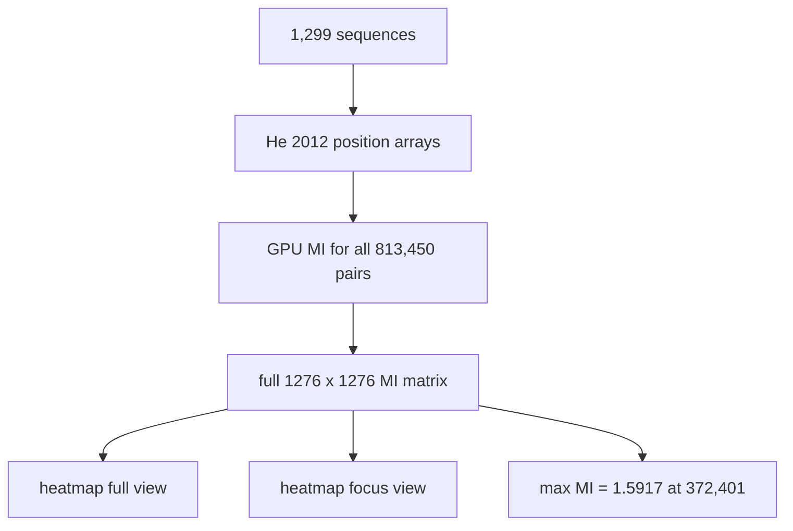

> **CORRECTION (Aug 7, 2026):** Two confirmed defects in the original pipeline
> (gap-stripping column misalignment; 8-bit QM wrap-around on 400-cell maps)
> invalidated the biological numbers in this file. See
> [CORRECTION_NOTICE.md](CORRECTION_NOTICE.md) for the verified corrected
> results (21 variable positions, 12 co-evolving pairs, 36 rules) and the
> corrected pipeline (analysis/corrected_pipeline.py). Numbers in this file
> describe the original (buggy) run unless stated otherwise.

# 06. create_mi_heatmap.py - The Full MI Landscape

## What the Program Does

This script computes the **complete mutual information matrix** for all 1,276 positions: every pair (i, j) with i < j, all 813,450 pairs. It then visualizes the matrix as a heatmap.

The comparison is **every position with every other position** across all 1,299 sequences. There is no window limit here. This is the most complete view of co-evolution in the dataset.

## The Algorithm

1. Parse all sequences, encode to He 2012 codes.
2. Build the dense position array (1,299 x 1,276).
3. On GPU, for every pair (i, j): count the joint distribution and compute MI with the bincount method.
4. Save the full matrix as `mi_matrix.npy` (and CSV).
5. Draw two heatmaps: the full 1,276 x 1,276 landscape and a focused view.

## The MI Formula (Recap)

```
```

$$MI(i, j) = \sum_{a,b} P(a,b) \log_2 \frac{P(a,b)}{P(a) P(b)}$$

```
```

where P(a) is the frequency of amino acid a at position i, P(b) at position j, and P(a, b) the joint frequency.

## Worked Example

The strongest pair is (372, 401) with MI = 1.5917. Position 372 is at sequence index 372 (0-based), position 401 at index 401. In the first sequence WRU87367.1 the residues are N at 372 and S at 401, but across the whole population the dominant combination is (A, N) in 814 of 1,299 sequences.

The MI is computed from the full joint distribution:

- P(372=A, 401=N) = 814/1299 = 0.6266
- P(372=A) = 0.6266 + (A with other partners)
- P(401=N) = 0.6266 + (other residues at 372 with N)

Because the joint P(A, N) is far above the product P(372=A) * P(401=N), the log ratio is large and positive, and the MI sums to 1.5917 bits.

## Worked Example: The Joint Distribution Behind Max MI (corrected data)

The strongest MI pair in the corrected (aligned) data is **(373, 378)** with
MI = 0.8067. The joint distribution over 1,294 valid sequences:

| 373 | 378 | Count | Frequency |
|-----|-----|-------|-----------|
| F | A | 970 | 75.0% |
| L | T | 311 | 24.0% |
| S | T | 12 | 0.9% |
| S | A | 1 | 0.1% |

The marginals are: P(373=F) = 0.75, P(373=L) = 0.24; P(378=A) = 0.75,
P(378=T) = 0.24. Under independence, the pair (F, A) would occur with
probability 0.75 x 0.75 = 0.56, but it actually occurs 0.75 of the time;
the pair (F, T) would occur 0.18 of the time under independence but is
essentially absent. This deviation is what MI = 0.8067 bits measures.

The maximum possible MI is min(H(373), H(378)) = min(0.872, 0.811) = 0.811
bits, so the observed value is 99.5% of the theoretical maximum: knowing
position 373 almost fully determines position 378.

## Results

| Metric | Value |
|--------|-------|
| Matrix size | 1,276 x 1,276 |
| Pairs computed | 813,450 |
| Max MI | 1.5917 (at 372, 401) |
| Mean MI (non-zero) | 0.6655 |
| Pairs with MI > 1.0 | 106,626 |
| GPU time | ~1.6 s |

## Inference

The heatmap shows a protein saturated with statistical dependence: over 100,000 position pairs carry more than 1 bit of MI. The strongest region is around positions 372 to 404 (S1 subunit, near the receptor binding domain). The full-length view reveals that the original 80-position analyses were looking at the N-terminal signal peptide, which is NOT the strongest co-evolution region. The real hub is in the S1 subunit.

**Caveat about MI:** MI captures total correlation, including indirect correlations. If position A correlates with B, and B correlates with C, then MI(A, C) can be large even if A and C have no direct coupling. This is exactly the limitation that Direct Coupling Analysis (script 18) fixes. The heatmap is the raw material; DCA is the cleaned version.

## Scholar Questions and Answers

**Q: What does "MI > 1.0" mean physically?**
A: Mutual information of 1 bit means knowing the residue at one position halves the uncertainty about the other position (in the binary sense). 106,626 pairs reach this level, which is a huge amount of co-variation.

**Q: Why are there so many high-MI pairs?**
A: The dataset is 1,299 Omicron sequences that share a common evolutionary history. Shared ancestry creates correlation everywhere. MI does not distinguish "co-evolved because coupled" from "co-evolved because shared history". This is the phylogenetic confound, which neither MI nor our Boolean rules correct for.

**Q: Is max MI 1.5917 a large value?**
A: MI is bounded by min(H(i), H(j)). Position 372 has H = 1.63 bits and position 401 has H = 1.67 bits, so the maximum possible MI is about 1.63 bits. The observed 1.5917 is 97.5% of the theoretical maximum: knowing position 372 almost fully determines position 401 and vice versa. This is near-deterministic co-evolution.

## Mermaid Diagram


