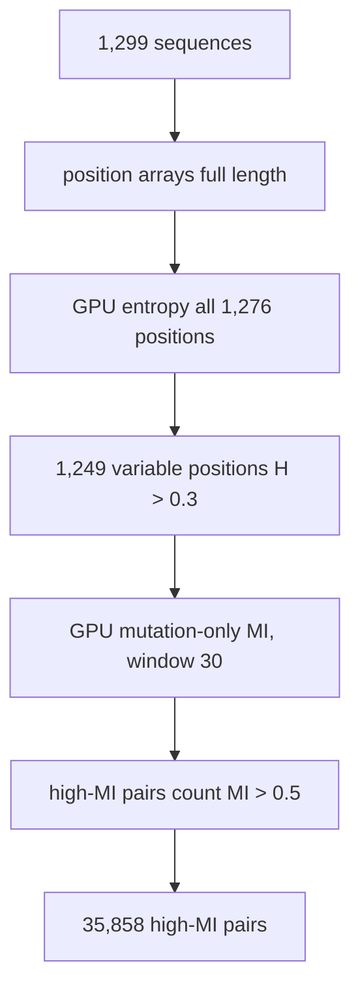

# 07. full_length_analysis.py - Full-Length Entropy and MI

## What the Program Does

This script answers: **how much co-evolution exists across the entire protein?**

It computes:
1. Shannon entropy for ALL 1,276 positions (not just the first 80).
2. Variable position identification (entropy > 0.3).
3. Mutation-only MI for ALL variable position pairs within a window of 30.
4. The count of high-MI pairs (MI > 0.5).

The comparison is between **all variable positions**, using the mutation-only MI convention (reference pairs excluded, as in script 01).

## The Algorithm

1. Encode all 1,299 sequences to He 2012 position arrays (full length).
2. GPU entropy for all positions.
3. Find variable positions (entropy > 0.3): 1,249 of 1,276.
4. GPU mutation-only MI for every pair of variable positions with |i - j| <= 30.
5. Count pairs with MI > 0.5.



## Worked Example: Entropy at a Key Position

Position 372 has entropy 1.6328 bits. The frequencies of the 20 amino acids at this position are spread across several residues (A dominant, plus T, K, F, C, and others). The entropy formula:

```
$$H = -\sum_{a} P(a) \log_2 P(a)$$
```

With P(A) = 0.63, P(T) = 0.15, P(K) = 0.09, P(F) = 0.04, P(C) = 0.03, and the rest small, the sum is approximately 1.63 bits. The perplexity 2^H = 3.10 means this position behaves like a 3.1-state variable.

Compare with a conserved position: entropy near 0, perplexity near 1.

## Results

| Metric | Value |
|--------|-------|
| Full length | 1,276 positions |
| Variable positions (H > 0.3) | 1,249 (97.9%) |
| Conserved positions | 27 (2.1%) |
| High-MI pairs (MI > 0.5, mutation-only, window 30) | **35,858** |
| Top variable position | 852 (H = 1.774 bits, S2 subunit) |

## Inference

97.9% of the Spike protein is evolutionarily variable in this Omicron dataset, and there are 35,858 strongly co-evolving position pairs. The protein is under intense, widespread evolutionary pressure with dense co-variation. The most variable position is 852 in the S2 subunit (H = 1.774 bits), not in the N-terminal region.

The 35,858 figure is a 7x increase over the earlier analysis that only considered the top 100 variable positions (which found 4,949 pairs). Full-length analysis reveals the true scale of co-evolution.

## Scholar Questions and Answers

**Q: Why 1,249 variable positions out of 1,276?**
A: The threshold is entropy > 0.3 bits. Positions with H <= 0.3 are effectively conserved (one amino acid dominates). Only 27 positions are that conserved in this dataset, because the 1,299 sequences span many Omicron sub-lineages with different mutations.

**Q: What is mutation-only MI and why use it here?**
A: For each pair (i, j), the reference pair (majority residue at i, majority residue at j) is excluded from the joint count. This measures co-variation of mutations rather than the trivial dominance of the reference pair. It gives a cleaner signal of compensatory changes.

**Q: What does 35,858 high-MI pairs mean for the protein?**
A: It means the evolutionary constraint network has tens of thousands of edges. This is consistent with the network analysis (script 20) which found 35,098 edges at MI > 0.5. The protein has a dense co-evolution core (largest connected component covers 53% of variable positions) with a tail of weakly coupled positions.
