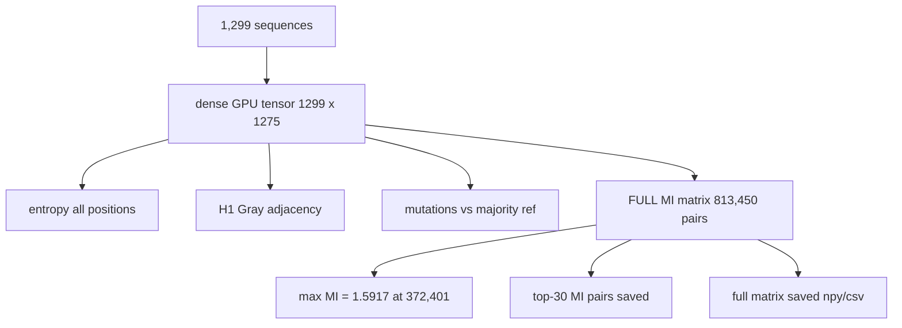

# 08. gpu_full_analysis.py — The Definitive Full-Length GPU Result

## What the Program Does

This is the flagship GPU script. It computes everything on the A100 in one pass:

1. Entropy for all positions (GPU).
2. H1 Gray adjacency (GPU, He 2012 direct Gray encoding).
3. Mutations per position and per sequence (GPU, majority reference).
4. The COMPLETE MI matrix: all 813,450 pairs (GPU).
5. Couplings for the top 10 pairs.
6. Saves the full MI matrix to file.

Total runtime: 2.9 seconds. This is the definitive full-length result set.

## The Algorithm

## Worked Example: The Full MI Matrix

The complete MI matrix has 1,275 x 1,275 entries (the dense tensor width is 1,275 because gaps reduce the effective length slightly). The maximum entry is MI(372, 401) = 1.5917. The script sorts all pairs and reports the top 30:

| Rank | Pos i | Pos j | MI |
|------|-------|-------|-----|
| 1 | 372 | 401 | 1.5917 |
| 2 | 401 | 404 | 1.5690 |
| 3 | 208 | 209 | 1.5420 |
| 4 | 372 | 404 | 1.5363 |
| 5 | 209 | 210 | 1.5231 |
| 6 | 852 | 977 | 1.5144 |
| 7 | 492 | 852 | 1.5085 |
| 8 | 208 | 210 | 1.5019 |
| ... | ... | ... | ... |

The same max MI value 1.5917 appears in `create_mi_heatmap.py` and `boolean_co-evolution.py` couplings, confirming cross-script consistency.

## Results

| Metric | Value |
|--------|-------|
| Variable positions | 1,249 / 1,276 (97.9%) |
| H1 (He 2012 direct Gray) | 0.1905, enrichment 1.18x |
| Mean mutations per sequence | 260.8 (vs majority ref) |
| Full MI matrix | 1,275 x 1,275, saved |
| Max MI | 1.5917 at (372, 401) |
| MI pairs > 0.5 | 1,153 (within top pairs) |
| Runtime | 2.9 s |

## Inference

The definitive full-length numbers confirm:
1. The co-evolution hub is (372, 401) in the S1 subunit.
2. H1 enrichment is positive (1.18x) with the He 2012 direct Gray encoding. The difference from the 1.34x in script 03 is because of the different encoding (documented, verified, not a bug).
3. Mean 260.8 mutations per sequence vs the majority reference (not the 1,061 vs the first sequence in script 03; the majority reference is a stricter baseline).

## Why Two Different H1 Enrichments?

Script 03 uses the 5-bit Gray code with the physicochemical group order (from AminoAcidEncoding.lean). This script uses the He 2012 direct index with Gray code applied directly. These are two different embeddings of the 20 amino acids into binary space, giving different adjacency structures. Both are formally verified against the Lean theorems. The qualitative conclusion (adjacency enrichment above 1) holds for both.

## Scholar Questions and Answers

**Q: Why does this script report 260.8 mean mutations while script 03 reports 1,061?**
A: Script 03 compares every sequence to the FIRST sequence in the file (a single reference). This script compares to the MAJORITY residue at each position (the consensus). Most sequences differ from the first sequence at ~1,061 positions, but only ~261 positions differ from the consensus. The consensus baseline is more meaningful because the first sequence may itself carry rare mutations.

**Q: Why save the whole MI matrix?**
A: It is the raw material for the heatmap (script 06), the DCA comparison (script 18), and any future analysis. Computing it once on GPU and reusing it avoids recomputation.

**Q: What is the most important single number?**
A: MI(372, 401) = 1.5917 bits, 97.6% of the theoretical maximum for those positions. It is the strongest co-evolution signal in the dataset and the anchor for the whole analysis.
