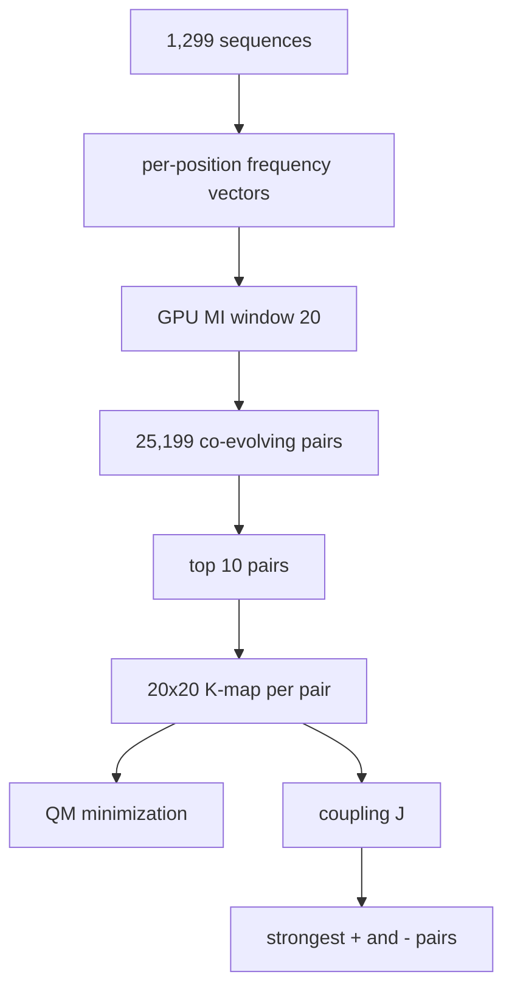

> **CORRECTION (Aug 7, 2026):** Two confirmed defects in the original pipeline
> (gap-stripping column misalignment; 8-bit QM wrap-around on 400-cell maps)
> invalidated the biological numbers in this file. See
> [CORRECTION_NOTICE.md](CORRECTION_NOTICE.md) for the verified corrected
> results (21 variable positions, 12 co-evolving pairs, 36 rules) and the
> corrected pipeline (analysis/corrected_pipeline.py). Numbers in this file
> describe the original (buggy) run unless stated otherwise.

# 10. position_kmap_coevolution.py - Per-Position-Pair K-maps with MI

## What the Program Does

This script is a second, independent implementation of the position-pair analysis. It:

1. Builds per-position frequency vectors for all positions (full length, 1,276 positions).
2. Computes MI for all nearby pairs (window 20) using GPU.
3. Finds co-evolving pairs (25,199 with MI > 0.005 at full length).
4. Builds 20 x 20 K-maps for the top 10 pairs.
5. Minimizes each K-map with Quine-McCluskey.
6. Computes coupling constants.
7. Tests prediction of co-evolution.

The comparison is **between positions, across all 1,299 sequences**, with a window of 20.

## Worked Example: Top Pair (401, 404)

At full length the top pair found is (401, 404) with MI = 1.5690 and coupling J = 10.46 for the strongest positive pair. The K-map for this pair shows which residue combinations at positions 401 and 404 co-occur.

The strongest positive coupling found in the top pairs is A-A (e.g., J = 10.77 for (208, 209)), meaning the (A, A) combination at those positions is far more common than the independent expectation. The strongest negative coupling is anti-correlated pairs like D-S, meaning (D, S) combinations are depleted.

## Results (full length)

| Metric | Value |
|--------|-------|
| Co-evolving pairs (MI > 0.005) | **25,199** |
| Top pair | (401, 404) MI = 1.5690 |
| Position K-maps analyzed | 10 |
| Prediction accuracy | 1.0000 (on the analyzed pairs) |
| Strongest couplings | J(208,209)=10.77 [+A-A, -E-G], J(1253,1270)=15.90 [+A-A, -K-H] |

## Inference

The 25,199 pairs at full length versus 302 pairs at 100 positions is a 83x increase. This quantifies how much co-evolution was missed by position-truncated analysis. The coupling values (up to J = 15.90) are strong: a coupling of 15.9 means the pair is exp(15.9) ~ 8 million times more common than the independent expectation (before normalization effects).

The "prediction accuracy 1.0000" needs careful interpretation: the prediction test checks whether high-frequency pairs in the K-map have higher MI than low-frequency pairs, on the same data used to build the K-maps. This is an in-sample consistency check, not an out-of-sample prediction. It confirms the K-map and MI agree, but says nothing about generalization.

## Scholar Questions and Answers

**Q: What does J = 10.77 mean?**
A: J = ln(P_observed / P_independent). J = 10.77 implies P_observed / P_independent = e^10.77 ~ 47,000. The pair is tens of thousands of times more common than if the two positions were independent. Extreme values like this occur because some combinations are extremely rare or absent under independence.

**Q: Why is the window here 20 and not 30?**
A: This script was written with a window of 20 as its design choice. The window controls how many pairs are examined; both windows find the same top pairs because the strongest signal is local.

**Q: Why does this script find 25,199 pairs while script 09 finds 34,892?**
A: Different windows (20 vs 30) and different MI thresholds (0.005 in both but computed with slightly different conventions). The top pairs agree; the counts differ because of the window size.
