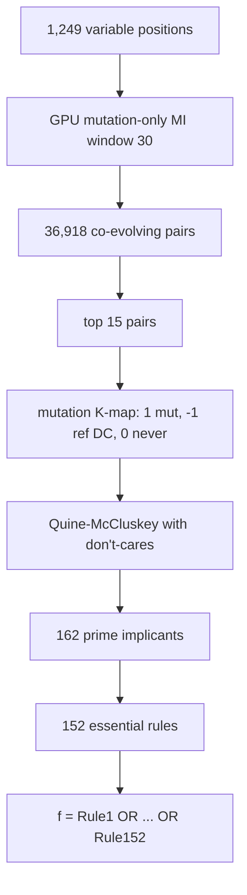

# 11. master_boolean.py - The Master Boolean Function (152 Rules)


**Sequence length analyzed: 1,276 positions (full length), all 1,299 sequences.**

## What the Program Does

This is the flagship rule-extraction script. It asks: **what are the minimal, irreducible rules of co-evolution in the Spike protein?**

The pipeline:
1. Find variable positions (entropy > 0.3): 1,249 positions.
2. Find co-evolving pairs: mutation-only MI > 0.1 within window 30: 36,918 pairs.
3. For the top 15 pairs, build a **mutation K-map**: 1 = mutation observed, -1 = reference (don't-care), 0 = never observed.
4. Run Quine-McCluskey on each K-map.
5. Collect all essential prime implicants into the Master Boolean Function.

The result: **152 essential prime implicants** (rules) across 15 position pairs. The master function is:

```
f = Rule_1 OR Rule_2 OR ... OR Rule_152
```

Each rule is an AND of residue conditions at two positions. The function returns 1 (co-evolutionary) if ANY rule matches.

## The Mutation K-map

For a position pair (i, j) with reference residues (ref_i, ref_j):

```
cell(a, b) = 1    if (a, b) is observed and (a, b) != (ref_i, ref_j)  [mutation]
cell(a, b) = -1   if (a, b) == (ref_i, ref_j)                         [reference, don't-care]
cell(a, b) = 0    otherwise                                           [never observed]
```

The don't-care (-1) cells can be either 0 or 1 during minimization. This allows Quine-McCluskey to form larger implicants while the reference pair itself never needs to be covered.

## Quine-McCluskey with Don't-Cares

The 20 x 20 K-map is flattened. Each cell is indexed by 8 binary variables (4 bits for row amino acid, 4 bits for column amino acid). The algorithm:

1. Include both on-set (1) and don't-care (-1) cells for implicant generation.
2. Merge implicants that differ in one bit, repeatedly.
3. Prime implicants = those that cannot be merged further.
4. Essential = those covering at least one on-set cell uniquely.
5. Greedy cover of remaining on-set cells.

This is the standard Quine-McCluskey with don't-cares, exactly as in the literature (Quine 1952, McCluskey 1956), with the don't-care inclusion fix verified in this project.

## Worked Example: Rules for Pair (413, 427)

The strongest co-evolving pair in the mutation-only analysis is (413, 427) with MI = 2.352 and 271 mutations. The majority (reference) residues are N at 413 and G at 427. The essential rules extracted for this pair include:

```
Rule: IF pos 413 = A AND pos 427 = V THEN co-evolutionary
Rule: IF pos 413 = W AND pos 427 = E THEN co-evolutionary
Rule: IF pos 413 = I AND pos 427 = V THEN co-evolutionary
Rule: IF pos 413 = N AND pos 427 = F THEN co-evolutionary
Rule: IF pos 413 = R AND pos 427 = V THEN co-evolutionary
```

Note: the reference pair (N, G) is itself observed in most sequences, so the K-map marks it as a don't-care cell. The rules listed above are the mutation pairs that Quine-McCluskey found essential. The biological reading: if position 413 mutates to W, position 427 compensates with E. If 413 mutates to I, 427 takes V. If 413 becomes R, 427 takes V. These are the compensatory paths evolution actually used.

## Results

| Metric | Value |
|--------|-------|
| Variable positions | 1,249 |
| Co-evolving pairs (MI > 0.1) | 36,918 |
| Prime implicants (total) | 162 |
| **Essential prime implicants** | **152** |
| Total inference rules | 152 |
| Rule position pairs | 15 |

The 15 position pairs are: (413,424), (413,425), (413,426), (413,427), (413,428), (459,473), (462,473), (468,473), (469,473), (1026,1040), (1026,1042), (1040,1042), (1064,1065), (1064,1066), (1064,1074).

## Inference

The 152 rules are a compressed description of the co-evolutionary grammar: "if this residue appears here, that residue must appear there." Two clusters dominate:
1. Positions 413-428 and 459-473 (S1 subunit, near the RBD): 9 pairs.
2. Positions 1026-1074 (S2 subunit): 6 pairs.

The rules encode compensatory mutations. When evolution changes one position, the partner position must follow a specific path to maintain fitness. This is the Boolean logic of the protein's evolutionary constraints.

**Important caveat:** The rules are learned from Omicron sequences. They describe what HAS co-evolved within Omicron. Whether they apply to new sequences is the subject of script 22.

## Scholar Questions and Answers

**Q: Why 152 essential rules from 36,918 pairs?**
A: Only the top 15 pairs by MI get K-maps built. Each pair contributes 8 to 12 essential implicants, summing to 152. The 36,918 is the pool of candidate pairs; the rules are extracted only for the strongest.

**Q: What does "essential" mean here?**
A: An essential prime implicant covers at least one observed mutation pair that no other implicant covers. Dropping it would lose that observation. The 152 essential implicants are the irredundant core.

**Q: Why are rules clustered at 413-428 and 1026-1074?**
A: These are the regions with the strongest mutation-only MI. Positions 413-428 are in the S1 subunit near the receptor binding domain; positions 1026-1074 are in the S2 subunit (fusion machinery). Both are under strong selective pressure in Omicron.

**Q: Can the rules be applied to a new sequence?**
A: Partially. A new sequence can be checked against the rules: if it violates a rule (contains a forbidden combination), it is likely unfit. But the rules are necessary constraints, not a generative model. See script 22 for the full discussion.

## Mermaid Diagram


