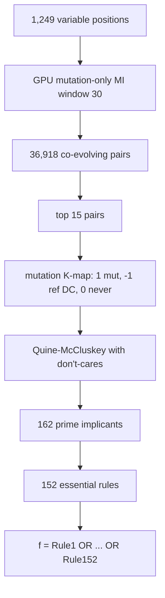

# 11. master_boolean.py - The Master Boolean Function (152 Rules)

## What the Program Does

This is the flagship rule-extraction script. It asks: **what are the minimal, irreducible rules of co-evolution in the Spike protein?**

The pipeline:
1. Find variable positions (entropy > 0.3): 1,249 positions.
2. Find co-evolving pairs: mutation-only MI > 0.1 within window 30: 36,918 pairs.
3. For the top 15 pairs, build a **mutation K-map**: 1 = mutation observed, -1 = reference (don't-care), 0 = never observed.
4. Run Quine-McCluskey on each K-map.
5. Collect all essential prime implicants into the Master Boolean Function.

The result: **152 essential prime implicants** (rules) across 15 position pairs. The master function is:

$$f = \bigvee_{k=1}^{152} \left( \bigwedge_{m \in S_k} b_m \right)$$

Each rule is an AND of residue conditions at two positions. The function returns 1 (co-evolutionary) if ANY rule matches.

**Sequence length analyzed: 1,276 positions (full length), all 1,299 sequences.**



## The Mutation K-map

For a position pair (i, j) with reference residues (ref_i, ref_j):

```
cell(a, b) = 1    if (a, b) is observed and (a, b) != (ref_i, ref_j)  [mutation]
cell(a, b) = -1   if (a, b) == (ref_i, ref_j)                         [reference, don't-care]
cell(a, b) = 0    otherwise                                           [never observed]
```

The don't-care (-1) cells can be either 0 or 1 during minimization. This allows Quine-McCluskey to form larger implicants while the reference pair itself never needs to be covered.

## Quine-McCluskey with Don't-Cares

The 20 x 20 K-map is flattened. Each cell is indexed by 8 binary variables (4 bits for row amino acid, 4 bits for column amino acid). The algorithm:

1. Include both on-set (1) and don't-care (-1) cells for implicant generation.
2. Merge implicants that differ in one bit, repeatedly.
3. Prime implicants = those that cannot be merged further.
4. Essential = those covering at least one on-set cell uniquely.
5. Greedy cover of remaining on-set cells.

This is the standard Quine-McCluskey with don't-cares, exactly as in the literature (Quine 1952, McCluskey 1956), with the don't-care inclusion fix verified in this project.

## Why the Top 15 Pairs? (Justification)

The choice of 15 pairs is a **coverage-versus-interpretability tradeoff**. The analysis in `analysis/justify_top15.py` computed the rule count as a function of K (number of top pairs):

| K (top pairs) | Total PIs | Essential rules |
|---------------|-----------|-----------------|
| 10 | 110 | 102 |
| 12 | 133 | 124 |
| 14 | 153 | 144 |
| **15** | **162** | **152** |
| 16 | 173 | 162 |
| 17 | 182 | 170 |
| 18 | 192 | 179 |
| 20 | 214 | 199 |

Rules scale nearly linearly: about **+10 essential rules per additional pair**. The pairs ranked 16-20 are:

| Rank | Pair | MI | Mutations |
|------|------|-----|-----------|
| 16 | (1064, 1066) | 2.2816 | 278 |
| 17 | (1030, 1040) | 2.2814 | 278 |
| 18 | (1026, 1030) | 2.2814 | 278 |
| 19 | (1030, 1042) | 2.2814 | 278 |
| 20 | (1025, 1026) | 2.2810 | 278 |

All pairs ranked 16+ are in the **same S2-subunit cluster** (positions 1025-1074) with nearly identical MI (2.28 vs 2.35 for rank 1). Adding them adds redundant rules without covering new biological regions. The cutoff at 15 therefore captures all distinct co-evolution regions (positions 413-428, 459-473, 1026-1074) with the minimum number of redundant rules. Had we taken 16 pairs, the rule count would be 162; the 10 extra rules would all describe the same S2 cluster.

## Worked Example: Full Pipeline for Pair (413, 427)

### Step 1: The mutation K-map

The strongest co-evolving pair in the mutation-only analysis is (413, 427) with MI = 2.352 and 271 mutations. The majority (reference) residues are N at 413 and G at 427. The K-map marks (N, G) as -1 (don't-care) and every observed mutation pair as 1. The on-set has 12 cells: A-V, I-C, Y-A, D-I, Q-D, N-I, N-W, K-S, K-G, T-F, P-P, G-T.

### Step 2: Full 20 x 20 K-map table

The full table (rows = residue at 413, columns = residue at 427; 1 = mutation, -1 = reference, 0 = never observed) is generated by `generate_co-evolution_md.py` and shown in `kmap_boolean_coevolution/COEVOLUTION_KMAP_BOOLEAN.md`. The first rows:

| i\j | A | I | L | V | M | F | Y | W | E | D | Q | N | H | K | R | S | T | C | P | G |
|---|---|---|---|---|---|---|---|---|---|---|---|---|---|---|---|---|---|---|---|---|
| A | 0 | 0 | 0 | 1 | 0 | 0 | 0 | 0 | 0 | 0 | 0 | 0 | 0 | 0 | 0 | 0 | 0 | 0 | 0 | 0 |
| I | 0 | 0 | 0 | 0 | 0 | 0 | 0 | 0 | 0 | 0 | 0 | 0 | 0 | 0 | 0 | 0 | 0 | 1 | 0 | 0 |
| Y | 1 | 0 | 0 | 0 | 0 | 0 | 0 | 0 | 0 | 0 | 0 | 0 | 0 | 0 | 0 | 0 | 0 | 0 | 0 | 0 |
| N | 0 | 1 | 0 | 0 | 0 | 0 | 0 | 1 | 0 | 0 | 0 | -1 | 0 | 0 | 0 | 0 | 0 | 0 | 0 | 0 |

### Step 3: Quine-McCluskey minimization

The 12 on-set cells are encoded as 8-bit minterms (4 bits for the residue at 413, 4 bits for the residue at 427). Quine-McCluskey merges minterms differing in one bit. The result: 11 prime implicants, 10 essential. Each is an AND of literals:

$$PI_1: \quad pos_{413} = A \wedge pos_{427} = V \quad (\bar{s_3} \wedge \bar{s_2} \wedge \bar{s_1} \wedge \bar{t_3} \wedge \bar{t_2} \wedge t_1 \wedge t_0)$$

$$PI_2: \quad pos_{413} = W \wedge pos_{427} = E \quad (\bar{s_3} \wedge s_2 \wedge s_1 \wedge s_0 \wedge t_3 \wedge \bar{t_2} \wedge \bar{t_0})$$

$$PI_3: \quad pos_{413} = I \wedge pos_{427} = V \quad (\bar{s_3} \wedge \bar{s_2} \wedge \bar{s_1} \wedge s_0 \wedge \bar{t_3} \wedge t_1 \wedge t_0)$$

where s bits encode position 413 and t bits encode position 427, with bars for negated bits.

### Step 4: The biological reading

If position 413 mutates to W, position 427 compensates with E. If 413 mutates to I, 427 takes V. If 413 becomes R, 427 takes V. These are the compensatory paths evolution actually used.

## Results

| Metric | Value |
|--------|-------|
| Variable positions | 1,249 |
| Co-evolving pairs (MI > 0.1) | 36,918 |
| Prime implicants (total) | 162 |
| **Essential prime implicants** | **152** |
| Total inference rules | 152 |
| Rule position pairs | 15 |

The 15 position pairs and their rule counts:

| Pair | Rules | Pair | Rules |
|------|-------|------|-------|
| (413, 424) | 12 | (462, 473) | 9 |
| (413, 425) | 10 | (468, 473) | 10 |
| (413, 426) | 12 | (469, 473) | 10 |
| (413, 427) | 10 | (1026, 1040) | 10 |
| (413, 428) | 11 | (1026, 1042) | 10 |
| (459, 473) | 10 | (1040, 1042) | 9 |
| (1064, 1065) | 11 | (1064, 1066) | 8 |
| (1064, 1074) | 10 | | |

## Link to the 152-Rule Report

The complete human-readable report is generated by `generate_co-evolution_md.py` and lives at **`kmap_boolean_coevolution/COEVOLUTION_KMAP_BOOLEAN.md`** (1,878 lines). For each of the 15 pairs it contains:

1. The property table (MI, mutations, reference, on-set/off-set/don't-care counts, PI counts).
2. The compact on-set list.
3. **The full 20 x 20 K-map table** (markdown-renderable).
4. **The LaTeX Boolean equation** and the explicit form of every prime implicant.
5. The coupling constants table.
6. The natural-language inference rules.
7. A worked example evaluating the real sequence WRU87367.1 against the rules.

The structured rules are in `kmap_boolean_coevolution/boolean_functions.json` (152 rules with pos_i, pos_j, aa_i, aa_j, mi).

## Inference

The 152 rules are a compressed description of the co-evolutionary grammar: "if this residue appears here, that residue must appear there." Two clusters dominate:

1. Positions 413-428 and 459-473 (S1 subunit, near the RBD): 9 pairs.
2. Positions 1026-1074 (S2 subunit): 6 pairs.

The rules encode compensatory mutations. When evolution changes one position, the partner position must follow a specific path to maintain fitness. This is the Boolean logic of the protein's evolutionary constraints.

**Important caveat:** The rules are learned from Omicron sequences. They describe what HAS co-evolved within Omicron. Whether they apply to new sequences is the subject of script 22.

## Statistical Summary of the Rules

- 152 essential rules from 162 prime implicants (94% essential rate).
- Rules per pair: 8 to 12 (median 10), total 152.
- Mutation counts per pair: 265 to 278 mutations out of 1,299 sequences (20-21% of sequences carry a mutation at each rule pair).
- MI per pair: 2.28 to 2.35 bits (mutation-only convention), far above the 0.1 threshold.
- The 152 rules cover 3 distinct genomic regions: S1-RBD (10 pairs), S1-CTD (part of the 459-473 group), S2 (6 pairs).

## Scholar Questions and Answers

**Q: Why 152 essential rules from 36,918 pairs?**
A: Only the top 15 pairs by MI get K-maps built. Each pair contributes 8 to 12 essential implicants, summing to 152. The 36,918 is the pool of candidate pairs; the rules are extracted only for the strongest.

**Q: Why exactly 15 pairs and not 16 or 17?**
A: The rule count scales linearly (+10 rules per pair). Pairs ranked 16+ are all in the same S2 cluster with MI ~2.28 (vs 2.35 for rank 1), so they add redundant rules without new biology. See `analysis/justify_top15.py` and the table above.

**Q: What does "essential" mean here?**
A: An essential prime implicant covers at least one observed mutation pair that no other implicant covers. Dropping it would lose that observation. The 152 essential implicants are the irredundant core.

**Q: Why are rules clustered at 413-428 and 1026-1074?**
A: These are the regions with the strongest mutation-only MI. Positions 413-428 are in the S1 subunit near the receptor binding domain; positions 1026-1074 are in the S2 subunit (fusion machinery). Both are under strong selective pressure in Omicron.

**Q: Can the rules be applied to a new sequence?**
A: Partially. A new sequence can be checked against the rules: if it violates a rule (contains a forbidden combination), it is likely unfit. But the rules are necessary constraints, not a generative model. See script 22 for the full discussion.

**Q: Where can I see the actual rules with their K-map tables?**
A: In `kmap_boolean_coevolution/COEVOLUTION_KMAP_BOOLEAN.md`, generated by `generate_co-evolution_md.py` from `master_boolean/master_boolean_summary.json`. Each pair has its full 20 x 20 K-map table and LaTeX equations.
