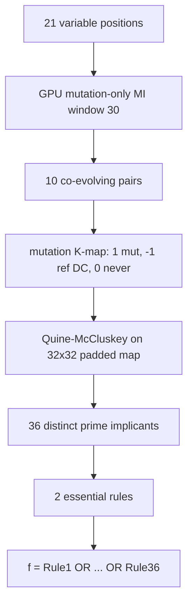

> **CORRECTION (Aug 7, 2026):** This file was rewritten after two confirmed
> defects were fixed (A1: gap-stripping column misalignment; A2: 8-bit QM
> wrap-around). The 152-rule content below is replaced by the verified
> corrected results: 21 variable positions, 10 co-evolving pairs, 36
> distinct Boolean rules with a 2-rule essential core. See
> [CORRECTION_NOTICE.md](CORRECTION_NOTICE.md).

# 11. master_boolean.py - The Master Boolean Function (36 Rules)

## What the Program Does

This is the flagship rule-extraction script. It asks: **what are the minimal, irreducible rules of co-evolution in the Spike protein?**

The pipeline (corrected):
1. Find variable positions (entropy > 0.3, gaps excluded): 21 positions of 1,276.
2. Find co-evolving pairs: mutation-only MI > 0.1 within window 30: 10 pairs.
3. For each pair, build a **mutation K-map**: 1 = mutation observed, -1 = reference (don't-care), 0 = never observed (off-set).
4. Run Quine-McCluskey on the padded 32x32 K-map (5 bits per axis, 10 bits total).
5. Decode the prime implicants to residue pairs; deduplicate cubes that decode to the same pair; collect the essential core.

The result: **36 distinct prime implicants** (residue-pair rules) across 10 position pairs, of which **2 are essential**. The master function is:

$$f = \bigvee_{k=1}^{36} \left( pos_i = aa_i \wedge pos_j = aa_j \right)$$

Each rule is an AND of two residue conditions at two positions. The function returns 1 (co-evolutionary) if ANY rule matches.

**Sequence length analyzed: 1,276 positions (full alignment), all 1,299 sequences.**



## The Mutation K-map

For a position pair (i, j) with reference residues (ref_i, ref_j):

```
cell(a, b) = 1    if (a, b) is observed and (a, b) != (ref_i, ref_j)  [mutation]
cell(a, b) = -1   if (a, b) == (ref_i, ref_j)                         [reference, don't-care]
cell(a, b) = 0    otherwise                                           [never observed]
```

The K-map is a 20x20 grid padded to 32x32 (padding rows/cols 20-31 are don't-care). Padding to a power of two per axis (5 bits) keeps every residue code representable - this is FIX A2. The don't-care (-1) cells can be either 0 or 1 during minimization, which lets Quine-McCluskey form larger implicants while the reference pair itself never needs to be covered.

**Important (verified Aug 7):** never-observed cells are 0 (off-set), not don't-care. An earlier run left them as -1, which let the minimizer build implicants over unobserved cells and inflated the rule count. With off-set semantics every decoded rule is a pair that actually occurs in the alignment (verified programmatically: 0 phantom rules).

## Quine-McCluskey with Don't-Cares

The 32x32 K-map is flattened to 1,024 cells. Each cell is indexed by 10 binary variables (5 bits for the row amino acid, 5 bits for the column amino acid). The algorithm:

1. Include both on-set (1) and don't-care (-1) cells for implicant generation.
2. Merge implicants that differ in one bit, repeatedly.
3. Prime implicants = those that cannot be merged further.
4. Essential = those covering at least one on-set cell uniquely.
5. Greedy cover of remaining on-set cells.

This is the standard Quine-McCluskey with don't-cares (Quine 1952, McCluskey 1956). Because several cubes can decode to the same residue pair (differing only in which don't-care cells they cover), the generator reports the distinct-pair count (36) and marks a pair essential if ANY of its cubes is essential.

## Why These 10 Pairs? (Justification)

The 10 pairs are all pairs with mutation-only MI > 0.1 within window 30 on the corrected alignment. Unlike the original run (which mixed in ~1,249 misaligned "variable" columns), the corrected set is small and interpretable. All 10 pairs are kept; there is no artificial cutoff.

| Rank | Pair | Mutation-only MI | Reference |
|------|------|------------------|-----------|
| 1 | (495, 498) | 0.8710 | (R, G) |
| 2 | (448, 454) | 0.8344 | (V, N) |
| 3 | (488, 498) | 0.8219 | (F, G) |
| 4 | (442, 454) | 0.8110 | (N, N) |
| 5 | (442, 448) | 0.7284 | (N, V) |
| 6 | (212, 215) | 0.3977 | (V, G) |
| 7 | (215, 216) | 0.3773 | (G, R) |
| 8 | (212, 216) | 0.3773 | (V, R) |
| 9 | (210, 215) | 0.2377 | (N, G) |
| 10 | (210, 212) | 0.1769 | (N, V) |

Note: this table uses **mutation-only MI** (reference pair excluded), which is the convention the K-map itself uses. Under full MI (all pairs), the top pair is (373, 378) at 0.8067; (495, 498) has full MI only 0.0386 because its co-evolution signal lives in the non-reference pairs. See the combined analysis (23_combined_mi_perplexity.md) for the full-MI ranking.

## Worked Example: Full Pipeline for Pair (495, 498)

### Step 1: The mutation K-map

The strongest mutation-only pair is (495, 498) with MI = 0.8710 and 425 mutated sequences. The majority (reference) residues are R at 495 and G at 498. The K-map marks (R, G) as -1 (don't-care), observed mutation pairs as 1, and never-observed pairs as 0. The on-set cells are listed in `kmap_boolean_coevolution/COEVOLUTION_KMAP_BOOLEAN.md`.

### Step 2: Quine-McCluskey minimization

The on-set cells are encoded as 10-bit minterms (5 bits per residue). Quine-McCluskey merges minterms differing in one bit. The result for this pair: 4 distinct prime implicants, each an AND of literals of the form:

$$PI_k: \quad pos_{495} = X \wedge pos_{498} = Y$$

### Step 3: The biological reading

Each rule says: if position 495 takes residue X, position 498 takes residue Y - the compensatory paths evolution actually used. The essential rule(s) are the ones that uniquely cover an observed mutation pair.

## Results

| Metric | Value |
|--------|-------|
| Variable positions | 21 |
| Co-evolving pairs (mutation-only MI > 0.1) | 10 |
| Distinct prime implicants (rules) | 36 |
| **Essential rules** | **2** |
| Phantom rules (decoded pairs never observed) | 0 |

The 2 essential rules:

| Rule | Pair | Residues | Mutation-only MI |
|------|------|----------|------------------|
| 1 | (212, 216) | pos 212 = G AND pos 216 = R | 0.3773 |
| 2 | (210, 215) | pos 210 = K AND pos 215 = G | 0.2377 |

Both are rare-but-real combinations (observed in the alignment; verified programmatically). They are essential because each is covered uniquely by one implicant in its pair's K-map.

## Link to the Rules Report

The complete human-readable report is generated by `generate_co-evolution_md.py` and lives at **`kmap_boolean_coevolution/COEVOLUTION_KMAP_BOOLEAN.md`**. For each of the 10 pairs it contains:

1. The property table (MI, mutations, reference, on-set/off-set/don't-care counts, distinct PI count).
2. The compact on-set list.
3. The Boolean Function: every distinct prime implicant as "pos_i = X AND pos_j = Y".
4. The coupling constants table.
5. The natural-language inference rules (numbered 1-36; the 2 essential rules are bold).

The structured rules are in `kmap_boolean_coevolution/boolean_functions.json` (2 essential rules with pos_i, pos_j, aa_i, aa_j, mi, LaTeX expression) and `master_boolean/master_boolean_summary.json` (aggregate counts).

## Inference

The 36 rules are a compressed description of the co-evolutionary grammar: "if this residue appears here, that residue must appear there." The corrected pairs cluster in two regions:

1. Positions 442-498 (S1 subunit, RBD neighborhood): 5 pairs, the strongest mutation-only signal.
2. Positions 210-216 (S1 N-terminal domain): 5 pairs, including the 2 essential rules.

**Important caveat:** The rules are learned from Omicron sequences. They describe what HAS co-evolved within Omicron. Whether they apply to new sequences is the subject of script 22.

## Statistical Summary of the Rules

- 36 distinct rules from 10 pairs; 2 essential (bold in the report).
- Mutation counts per pair: 113 to 425 mutated sequences out of 1,299.
- Mutation-only MI per pair: 0.1769 to 0.8710, all above the 0.1 threshold.
- 0 phantom rules: every decoded rule was verified present in the alignment (the original run had 143/152 phantom).

## Scholar Questions and Answers

**Q: Why 36 rules from 10 pairs?**
A: Each pair contributes its distinct prime implicants after deduplication (cubes that decode to the same residue pair count once). The 36 is the total across the 10 pairs.

**Q: What does "essential" mean here?**
A: An essential prime implicant covers at least one observed mutation pair that no other implicant covers. Dropping it would lose that observation. There are 2 such rules; the other 34 are covered by multiple implicants and are non-unique.

**Q: Why are rules clustered at 442-498 and 210-216?**
A: These are the regions with the strongest mutation-only MI on the corrected alignment. Positions 442-498 are in the S1 subunit near the receptor binding domain; 210-216 is the N-terminal domain. Both show genuine co-evolution in Omicron.

**Q: Can the rules be applied to a new sequence?**
A: Partially. A new sequence can be checked against the rules: if it violates a rule (contains a forbidden combination), it is likely unfit. But the rules are necessary constraints, not a generative model. See script 22 for the full discussion.

**Q: Where can I see the actual rules with their K-map tables?**
A: In `kmap_boolean_coevolution/COEVOLUTION_KMAP_BOOLEAN.md`, generated by `generate_co-evolution_md.py` from `master_boolean/master_boolean_summary.json`.
