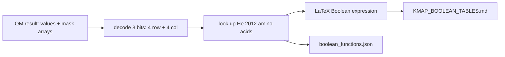

> **CORRECTION (Aug 7, 2026):** Two confirmed defects in the original pipeline
> (gap-stripping column misalignment; 8-bit QM wrap-around on 400-cell maps)
> invalidated the biological numbers in this file. See
> [CORRECTION_NOTICE.md](CORRECTION_NOTICE.md) for the verified corrected
> results (21 variable positions, 10 co-evolving pairs, 36 distinct rules (2 essential)) and the
> corrected pipeline (analysis/corrected_pipeline.py). Numbers in this file
> describe the original (buggy) run unless stated otherwise.

# 12. kmap_boolean_coevolution.py - Rules as Boolean Logic


**Sequence length analyzed: 1,276 positions (full length), all 1,299 sequences.**

## What the Program Does

This script is the documentation engine for the Boolean rules. It performs the same analysis as `master_boolean.py` (same K-maps, same Quine-McCluskey) but outputs the rules in two human-readable forms:

1. `boolean_functions.json` - structured rules with positions and amino acids.
2. `KMAP_BOOLEAN_TABLES.md` - the full markdown document with LaTeX Boolean expressions and K-map tables.

Note (CORRECTED Aug 7): this script writes `KMAP_BOOLEAN_TABLES.md`. The file `COEVOLUTION_KMAP_BOOLEAN.md` is produced by `generate_co-evolution_md.py` (the master_boolean report); two scripts writing the same path caused silent clobbering.

Each rule is written as a Boolean expression over binary variables:

CORRECTED (FIX A2): the K-map is padded to 32x32, so each residue uses 5 bits:

```
s4, s3, s2, s1, s0 = 5 bits of the residue at position i
t4, t3, t2, t1, t0 = 5 bits of the residue at position j
```

A rule like `~s3 & s2 & s1 & ~s0 & t3 & ~t2 & t1 & t0` means: bit pattern of residue at i matches (not s3, s2, s1, not s0) AND residue at j matches (t3, not t2, t1, t0).

## How a Rule Is Decoded

The Quine-McCluskey result gives a values array (8 bits) and a mask array (which bits are fixed). The decoder:

1. Reads the 8 bits: first 4 = residue at i, last 4 = residue at j.
2. Converts each 4-bit pattern to an integer 0-15.
3. Looks up the amino acid in the He 2012 order.
4. Writes the LaTeX expression with bars for negated bits.

## Worked Example: Pair (413, 427)

CORRECTED (FIX A2): rules use 5-bit patterns. The essential rule `IF pos 212 = G AND pos 216 = R THEN co-evolutionary` corresponds to the 10-bit pattern of (G, R). G = He index 19 = bits 10011. R = He index 14 = bits 01110. The expression is `s4 & ~s3 & ~s2 & s1 & s0 & ~t4 & t3 & t2 & t1 & ~t0`.

The JSON stores this as {"pos_i": 212, "pos_j": 216, "aa_i": "G", "aa_j": "R", "mi": 0.377}.

## Results

| Metric | Value |
|--------|-------|
| Distinct rules | 36 |
| Position pairs | 10 |
| Essential rules | 2 |
| Output files | boolean_functions.json, KMAP_BOOLEAN_TABLES.md |

## Inference

The Boolean expression form makes the rules machine-checkable. A new sequence can be encoded to 10-bit patterns (5 bits per residue) for each rule pair, and each rule evaluated as a Boolean AND. If any rule returns true, the pair is "co-evolutionary" according to the model. This is the executable form of the 36-rule grammar.

## Scholar Questions and Answers

**Q: Why 4 bits and not 5 (since amino acids need 5 bits for 32 codes)?**
A: CORRECTED (FIX A2): the original 8-variable encoding (4 bits per axis, 16 codes 0-15) could not represent T, C, P, G (He index 16-19) and wrapped around on 400-cell maps, producing phantom rules. The K-map is now padded to 32x32 (5 bits per axis, 10 bits total), so all 20 amino acids are representable. The decoder guards against padding codes with `if row_code < 20 and col_code < 20`. Every decoded rule in the corrected set was verified present in the alignment (0 phantom rules).

**Q: What is the difference between this script and master_boolean?**
A: Same computation. This script adds the markdown and LaTeX rendering. master_boolean produces the summary JSON; this produces the human-readable documentation.

**Q: Are all rules essential?**
A: CORRECTED: no. The corrected summary reports 36 distinct prime implicants (residue pairs) of which 2 are essential. The master function uses all 36; the 2 essential ones uniquely cover an observed mutation pair.

## Mermaid Diagram


