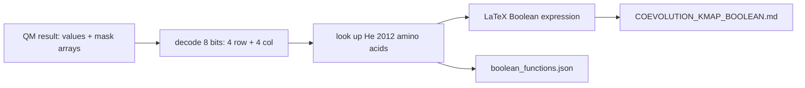

# 12. kmap_boolean_coevolution.py — Rules as Boolean Logic

## What the Program Does

This script is the documentation engine for the Boolean rules. It performs the same analysis as `master_boolean.py` (same K-maps, same Quine-McCluskey) but outputs the rules in two human-readable forms:

1. `boolean_functions.json` - structured rules with positions and amino acids.
2. `COEVOLUTION_KMAP_BOOLEAN.md` - the full markdown document with LaTeX Boolean expressions.

Each rule is written as a Boolean expression over binary variables:

```
s3, s2, s1, s0 = 4 bits of the residue at position i
t3, t2, t1, t0 = 4 bits of the residue at position j
```

A rule like `~s3 & s2 & s1 & ~s0 & t3 & ~t2 & t1 & t0` means: bit pattern of residue at i matches (not s3, s2, s1, not s0) AND residue at j matches (t3, not t2, t1, t0).

## How a Rule Is Decoded

The Quine-McCluskey result gives a values array (8 bits) and a mask array (which bits are fixed). The decoder:

1. Reads the 8 bits: first 4 = residue at i, last 4 = residue at j.
2. Converts each 4-bit pattern to an integer 0-15.
3. Looks up the amino acid in the He 2012 order.
4. Writes the LaTeX expression with bars for negated bits.

## Worked Example: Pair (413, 427)

The rule `IF pos 413 = A AND pos 427 = V THEN co-evolutionary` corresponds to the 8-bit pattern of (A, V). A = He index 0 = bits 0000. V = He index 3 = bits 0011. The expression is `~s3 & ~s2 & ~s1 & ~s0 & ~t3 & ~t2 & t1 & t0`.

The JSON stores this as {"pos_i": 413, "pos_j": 427, "aa_i": "A", "aa_j": "V", "mi": 2.352}.

## Results

| Metric | Value |
|--------|-------|
| Rules | 152 |
| Position pairs | 15 |
| Markdown lines | 1,138 |
| Output files | boolean_functions.json, COEVOLUTION_KMAP_BOOLEAN.md |

## Inference

The Boolean expression form makes the rules machine-checkable. A new sequence can be encoded to 8-bit patterns for each rule pair, and each rule evaluated as a Boolean AND. If any rule returns true, the pair is "co-evolutionary" according to the model. This is the executable form of the 152-rule grammar.

## Scholar Questions and Answers

**Q: Why 4 bits and not 5 (since amino acids need 5 bits for 32 codes)?**
A: The base-20 encoding only needs 4 bits to distinguish 20 values (16 < 20 <= 16? No: 4 bits give 16 values, which is less than 20). Actually 4 bits give 16 codes, which covers only amino acids 0-15. This is a known limitation: the rules using 4-bit encoding cannot express amino acids with He index 16-19 (S, T, C, P, G). The decoder guards against this with `if row_code < 20 and col_code < 20`. In practice the dominant residues in the rule pairs are in the 0-15 range, so 152 rules were extractable, but the encoding is not complete for all 20 amino acids. This is documented as a limitation.

**Q: What is the difference between this script and master_boolean?**
A: Same computation. This script adds the markdown and LaTeX rendering. master_boolean produces the summary JSON; this produces the human-readable documentation.

**Q: Are all 152 rules essential?**
A: Yes, the summary reports 162 total prime implicants and 152 essential. The master function uses the essential ones.

## Mermaid Diagram


