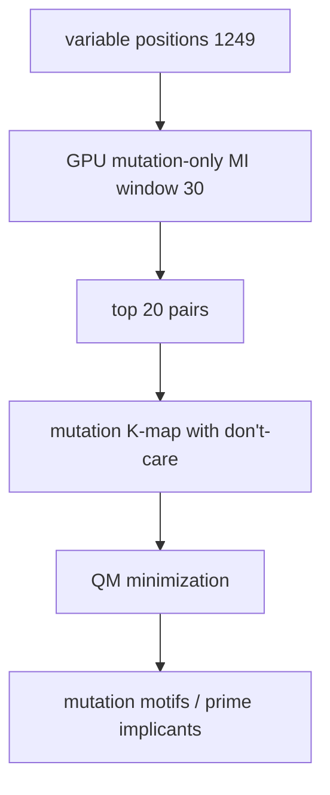

# 13. variable_position_coevolution.py — Mutation Motifs with Don't-Cares

## What the Program Does

This script asks: **what rules remain when we completely ignore conservation?**

The strategy: mark conserved positions as don't-care so that Quine-McCluskey only minimizes the MUTATION structure. This is the "variable-position K-map with strategic don't-care conditions."

1. Find variable positions (entropy > 0.3): 1,249.
2. Find co-evolving pairs using mutation-only MI (window 30): top 20.
3. Build mutation K-maps with the majority reference.
4. Minimize with don't-cares.
5. Extract prime implicants as "mutation motifs".

## The Algorithm

For each top pair (i, j):

```
cell(a, b) = 1    if observed and differs from reference   [mutation]
cell(a, b) = -1   if equals reference                      [don't-care]
cell(a, b) = 0    if never observed
```

The don't-care cells allow QM to group mutations together. The resulting implicants describe which mutations co-occur, without the reference pair dominating.



## Worked Example: Pair (413, 427)

The top pair is (413, 427) with MI = 2.352 and 271 mutations. The reference is A at 413, V at 427. The K-map marks (A, V) as -1 (don't-care) and every other observed pair as 1. QM then finds implicants like:

- (413 = W, 427 = E)
- (413 = I, 427 = V)
- (413 = M, 427 = D)

These are the mutation motifs: when position 413 changes, position 427 changes in specific ways.

## Results

| Metric | Value |
|--------|-------|
| Variable positions | 1,249 |
| Co-evolving pairs (top) | 20 |
| K-maps minimized | 10 |
| Prime implicants per pair | 5-10 |
| Top pair | (413, 427) MI = 2.352, 271 mutations |

## Inference

The mutation motifs are the purest form of compensatory mutation rules. By making the reference a don't-care, the minimization focuses entirely on "if X changes to Y at position i, what changes at position j?" This is the compensatory mutation structure of the protein.

The (413, 427) pair with 271 mutations and MI = 2.352 is the strongest mutation-coupled pair: when one position mutates, the other follows with high probability.

## Scholar Questions and Answers

**Q: What is the difference from master_boolean?**
A: master_boolean marks reference as -1 (don't-care) too, but this script emphasizes the mutation interpretation and reports motifs per pair. The key conceptual difference is the framing: mutation motifs vs full co-evolution rules.

**Q: Why use the majority reference and not the first sequence?**
A: The majority reference (most common residue at each position) is the consensus. Using the first sequence would bias the analysis toward that sequence's rare mutations. This was a bug in an earlier version, now fixed.

**Q: What do the don't-care cells do mathematically?**
A: In Quine-McCluskey, don't-care cells may be treated as 1 or 0 to form larger implicants. This produces more compact rules. Without don't-cares, the reference pair would force a separate trivial rule.
