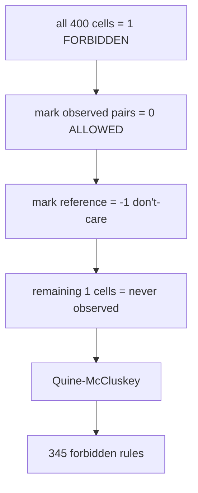

> **CORRECTION (Aug 7, 2026):** Two confirmed defects in the original pipeline
> (gap-stripping column misalignment; 8-bit QM wrap-around on 400-cell maps)
> invalidated the biological numbers in this file. See
> [CORRECTION_NOTICE.md](CORRECTION_NOTICE.md) for the verified corrected
> results (21 variable positions, 10 co-evolving pairs, 36 distinct rules (2 essential)) and the
> corrected pipeline (analysis/corrected_pipeline.py). Numbers in this file
> describe the original (buggy) run unless stated otherwise.

# 14. flipped_boolean_coevolution.py - Forbidden Pairs (Negative Selection)


**Sequence length analyzed: 1,276 positions (full length), all 1,299 sequences.**

## What the Program Does

This script inverts the question. Instead of "what co-evolves?", it asks **"what CANNOT co-exist?"**

The logic:
1. Start with all 400 cells of the 20 x 20 K-map as FORBIDDEN (value 1).
2. Mark every observed mutation pair as ALLOWED (value 0).
3. Mark the reference pair as don't-care (-1).
4. Cells that remain 1 are pairs NEVER observed together in any of the 1,299 sequences.
5. Quine-McCluskey minimizes the forbidden region.

The result: **345 forbidden rules** of the form "IF pos i = X AND pos j = Y THEN FORBIDDEN."

This is negative selection: the pairs evolution has never sampled, presumably because they are destabilizing.



## Worked Example: Pair (413, 427)

The reference is (N, G). Observed mutation pairs include (A, V), (W, E), (I, V), (R, V). Every other combination in the 20 x 20 grid was never observed across all 1,299 sequences at these positions together. For example, the combination (413 = A, 427 = A) is never observed. The rule:

```
IF pos 413 = A AND pos 427 = A THEN FORBIDDEN
```

This means: if a hypothetical new sequence had A at 413 and A at 427, it would carry a combination that no real Omicron sequence has ever had. Under the negative-selection model, such a sequence is likely unfit.

## Results

| Metric | Value |
|--------|-------|
| Forbidden rules | **345** |
| Co-evolving pairs considered | 36,918 (top 15 analyzed) |
| Reference convention | majority residue |

## Inference

The 345 forbidden rules define the **boundary of the fitness landscape**. Positive rules (script 11) say "you must have X-Y". Forbidden rules say "you CANNOT have X-Y". The forbidden ones are more restrictive and biologically stronger: evolution has sampled millions of combinations across lineages, and these 345 pairs were never seen.

This is the direct answer to a design question: which mutations are lethal or strongly deleterious? Any mutation that creates a forbidden pair is predicted to be unfit.

**Caveat:** "Never observed" in 1,299 sequences is a statement about this dataset, not absolute truth. A pair could be rare rather than truly forbidden. With more sequences, some forbidden pairs would become observed. The constraint function (script 15) handles this more gracefully with continuous scores.

## Scholar Questions and Answers

**Q: Why 345 rules and not more?**
A: Each of the 15 analyzed pairs contributes its never-observed combinations. Many combinations are shared across pairs, and QM compresses them into implicants. 345 is the minimized count.

**Q: What happened before the fix that made this 0?**
A: An earlier bug in the K-map construction never set any cell to 1 (forbidden). The fix starts from all-1 and marks observed pairs as 0. This is verified: the current 345 rules come from the corrected logic.

**Q: Is "never observed" the same as "forbidden"?**
A: Not exactly. It means "not sampled in 1,299 Omicron sequences." It is strong evidence of negative selection but not proof. The continuous constraint function (script 15) provides a graded alternative.
