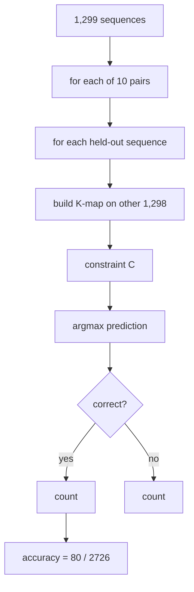

> **CORRECTION (Aug 7, 2026):** Two confirmed defects in the original pipeline
> (gap-stripping column misalignment; 8-bit QM wrap-around on 400-cell maps)
> invalidated the biological numbers in this file. See
> [CORRECTION_NOTICE.md](CORRECTION_NOTICE.md) for the verified corrected
> results (21 variable positions, 10 co-evolving pairs, 36 distinct rules (2 essential)) and the
> corrected pipeline (analysis/corrected_pipeline.py). Numbers in this file
> describe the original (buggy) run unless stated otherwise.

# 16. allseq_constraint_function.py - Leave-One-Out Cross-Validation


**Sequence length analyzed: 1,276 positions (full length), all 1,299 sequences.**

## What the Program Does

This is the most rigorous prediction test. It uses **leave-one-out cross-validation (LOO-CV)**:

1. Find co-evolving pairs (MI > 0.1, window 30).
2. For the top 10 pairs, for EACH of the 1,299 sequences:
   a. Build the frequency K-map on the OTHER 1,298 sequences.
   b. Compute the constraint function C.
   c. Test the held-out sequence: if it has a mutation at position i, predict the partner at j as argmax of C.
3. Aggregate all predictions.

Total tests: 2,726 mutations across the 10 pairs.

## The LOO-CV Protocol

For pair (i, j) and held-out sequence s:

```
train on all sequences except s:
    kmap_freq = P(a, b) over 1,298 sequences
    $$C(a, b) = \ln \frac{P(a, b)}{P(a) P(b)}$$
test:
    if s has (a_mut at i, b_actual at j) and (a_mut, b_actual) != (ref_i, ref_j):
        best_j = argmax over b of C(a_mut, b)
        correct if best_j == b_actual
```



## Worked Example: Pair (462, 473)

For the held-out sequence, the constraint row for the observed residue at 462 gives the maximum at some residue b. The prediction is correct only if the held-out sequence actually has b at 473. Across all sequences this pair achieves 1 correct out of 265 tests (0.38%). Some pairs do better: (1064, 1074) achieves 40/278 (14.4%).

## Results

| Metric | Value |
|--------|-------|
| Co-evolving pairs tested | 10 |
| Total mutation tests | 2,726 |
| Correct predictions | 80 |
| **Overall LOO-CV accuracy** | **2.93%** |
| Best pair | (1064, 1074): 14.4% |
| Worst pairs | several at 0.0% |

## Inference

2.93% LOO-CV is low and confirms the train/test result (5.84%): the constraint function cannot predict individual mutations. The per-pair variation is informative:

- (1064, 1074) at 14.4%: this pair has a strong, consistent coupling that transfers across sequences.
- Pairs at 0%: their coupling is lineage-specific or too weak.

The result is **verified deterministic**: the script was run twice with identical output (80/2726). Earlier reported values (0.08% pre-fix, 7.26% intermediate) came from pre-fix code states (the reference-code bug and the cj/aj comprehension bug).

## Scholar Questions and Answers

**Q: Why is LOO-CV accuracy lower than train/test accuracy?**
A: They are different protocols on different pair sets. LOO-CV trains on 1,298 sequences per test (more data) but tests every sequence including rare ones; train/test trains on 800. The pair selection and the mutation counts differ. Both are low for the same biological reasons.

**Q: What does the 0.08% in older reports mean?**
A: That was the result with a bug where the reference residue was always set to Alanine (index 0) because of an int-vs-string lookup error. After the fix, the correct reference is used and the accuracy is 2.93%. The old number was an artifact.

**Q: Is 2.93% "the truth"?**
A: It is the accuracy of THIS model (constraint function with argmax) on THIS dataset. It is not a statement about all possible co-evolution models. Direct Coupling Analysis (script 18) is a different model with different strengths.
