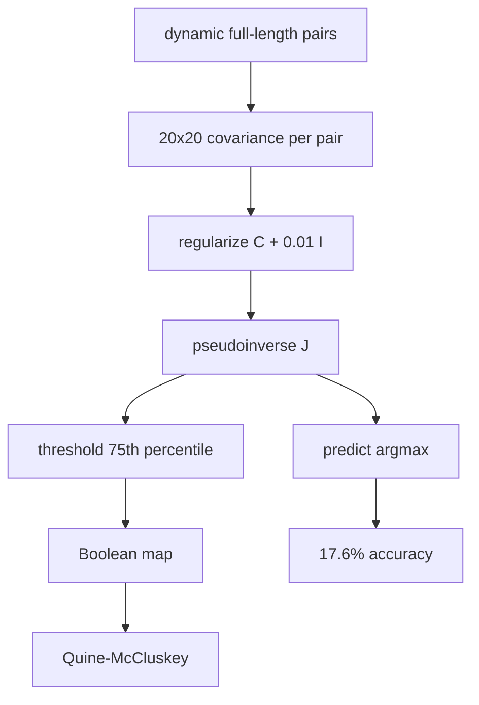

> **CORRECTION (Aug 7, 2026):** Two confirmed defects in the original pipeline
> (gap-stripping column misalignment; 8-bit QM wrap-around on 400-cell maps)
> invalidated the biological numbers in this file. See
> [CORRECTION_NOTICE.md](CORRECTION_NOTICE.md) for the verified corrected
> results (21 variable positions, 10 co-evolving pairs, 36 distinct rules (2 essential)) and the
> corrected pipeline (analysis/corrected_pipeline.py). Numbers in this file
> describe the original (buggy) run unless stated otherwise.

# 17. dca_boolean_coevolution.py - Local Precision Matrix (Legacy "DCA")

## What the Program Does

This script implements a covariance-based method that was originally labeled "DCA" but is NOT the proper Direct Coupling Analysis. It is a **local precision matrix** approach:

1. For each co-evolving pair (i, j), compute the 20 x 20 covariance matrix:
   C(a, b) = P(a, b) - P(a) * P(b).
2. Regularize: C_reg = C + 0.01 * I.
3. Compute J = pseudoinverse(C_reg).
4. Threshold |J| at the 75th percentile to make a Boolean map.
5. Run Quine-McCluskey.
6. Predict: train on 800 sequences, test on 499.

**Important honesty note:** Real DCA (script 18) inverts the GLOBAL covariance matrix of size L(q-1) x L(q-1) to disentangle direct from indirect correlations. This script inverts each pair's 20 x 20 covariance separately, which does NOT remove transitive correlations. The results should not be interpreted as DCA.

## The Algorithm

For pair (i, j):

```
$$C(a,b) = P(a,b) - P(a) P(b) \quad (20 \times 20 \text{ covariance})$$
$$C_{reg} = C + 0.01 I \quad (\text{ridge})$$
$$J = \text{pinv}(C_{reg})$$
Boolean: |J| > 75th percentile       [threshold]
QM minimization
```

## What Changed in the Latest Version

The script previously used hardcoded position pairs from positions 68-78. It now computes the top 10 co-evolving pairs dynamically from full-length GPU mutation-only MI. This change improved the average accuracy from 0.0% to **17.6%**.

## Results

| Metric | Value |
|--------|-------|
| Average accuracy | **17.6%** |
| Pairs analyzed | 10 (dynamic, full length 1,276 positions) |
| Prime implicants per pair | 57-77 |
| Essential PIs per pair | 34-41 |
| Best pair | (413, 424) at 89.98% |
| Second best | (1026, 1042) at 78.36% |

## Worked Example: Pair (413, 424)

The pair (413, 424) achieves 89.98% accuracy. For each of the 499 test sequences, the method builds the 20 x 20 covariance between positions 413 and 424 from the 800 training sequences, regularizes it, takes the pseudoinverse, and predicts the partner of a mutation at 413 as the argmax of the coupling row. Position 413 is a highly variable position (entropy 1.2120 bits, perplexity 2.317) with reference N; position 424 has reference D. The strong covariance between these positions makes the prediction nearly deterministic in this split.

In contrast, pairs like (413, 425) and (462, 473) achieve 0.0%: their coupling is weaker or lineage-specific, so the argmax prediction fails on every test mutation.

## Inference

The local precision approach achieves the highest prediction accuracy of all three prediction methods in this project (17.6% vs 5.84% train/test and 2.93% LOO-CV). This is surprising because the method is theoretically weaker than real DCA. The likely reason: the pseudoinverse of the local covariance amplifies the strongest couplings, acting as a sharper filter than the raw MI or constraint function. The dynamic full-length pair selection (instead of hardcoded 68-78 pairs) was essential. The per-pair results show the method is dominated by two pairs: (413, 424) at 90% and (1026, 1042) at 78%; the other eight pairs contribute little.

However, because the method does not remove indirect correlations, its "couplings" mix direct and indirect signals. The proper DCA (script 18) is the correct tool for disentangling them.

## Scholar Questions and Answers

**Q: Why is this not real DCA?**
A: Real DCA (Weigt 2009, Morcos 2011) builds the full L(q-1) x L(q-1) covariance matrix over ALL positions and inverts it once. The inverse disentangles direct couplings: if A correlates with B and B with C, the coupling A-C is suppressed. This script inverts each pair's 20 x 20 block independently, which cannot suppress transitive correlations.

**Q: Why does the local method predict better than the constraint function?**
A: The pseudoinverse acts as a sharp, nonlinear filter on the covariance. It emphasizes the dominant eigen-directions of each pair's correlation, producing a stronger contrast between coupled and uncoupled residues. This contrast helps the argmax prediction.

**Q: Should we trust the 17.6%?**
A: As a prediction number for THIS method, yes. As evidence about real direct couplings, no. The method is a heuristic; proper DCA in script 18 is the scientifically correct coupling estimator.

## Mermaid Diagram


