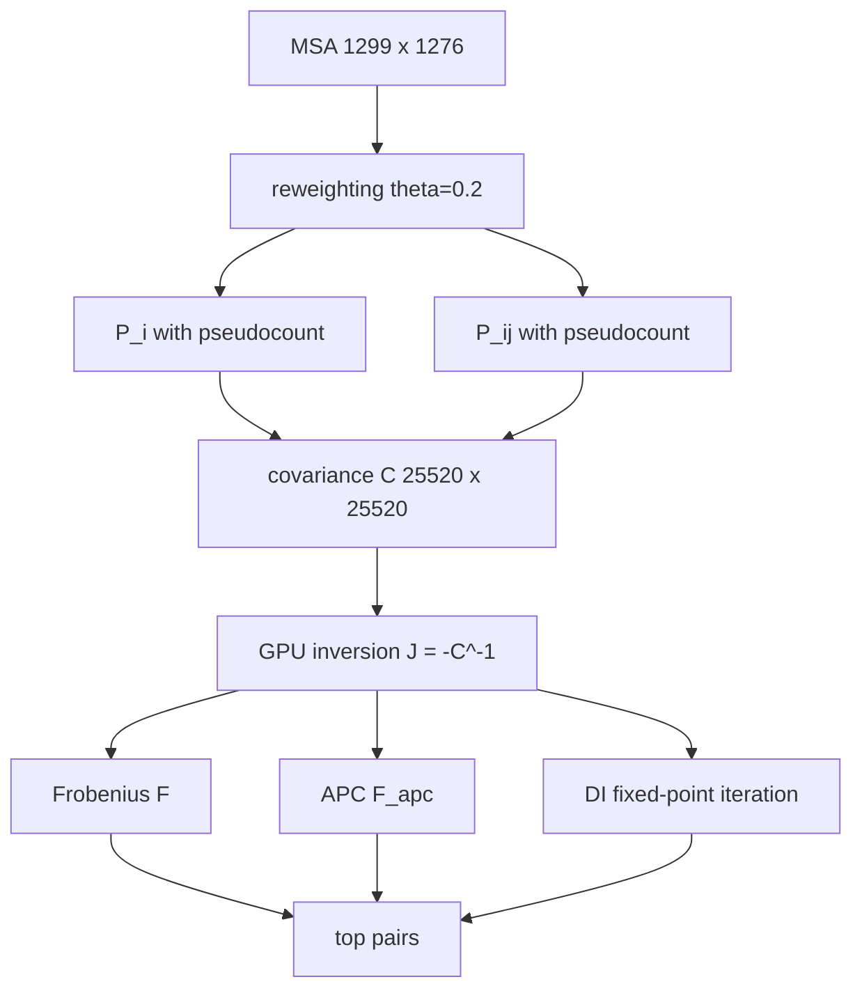

# 18. dca_mf_analysis.py - Proper Mean-Field Direct Coupling Analysis

## What the Program Does

This is the corrected, proper implementation of Direct Coupling Analysis (DCA) following Morcos et al. 2011 (PNAS 108:E1293) and Weigt et al. 2009 (PNAS 106:67). It was implemented from the published algorithm and verified in-session against a brute-force reference implementation (maximum difference 0.00e+00, see validation log).

DCA answers: **which position pairs are DIRECTLY coupled, after removing indirect/transitive correlations?**

The key difference from MI: if position A correlates with B, and B correlates with C, then MI(A, C) is large even if A and C have no direct interaction. DCA inverts the global covariance matrix to suppress exactly this transitivity.

## The Algorithm (Step by Step)

### 1. Sequence reweighting

Sequences with more than 80% identity (theta = 0.2) are downweighted. Each sequence l gets weight:

```
$$W_l = \frac{1}{\#\{m : \text{Hamming}(x_l, x_m) \le 0.2 L\}}$$
$$M_{eff} = \sum_l W_l$$
```

In our data Meff = 1.0, meaning all 1,299 sequences are unique at 80% identity (no redundancy). The reweighting leaves the data unchanged but is a required part of the algorithm.

### 2. Single-site frequencies with pseudocount

```
$$P_i(a) = (1-\lambda) \frac{1}{M_{eff}} \sum_l W_l \, [x_{li} = a] + \frac{\lambda}{q}$$
```

with lambda = 0.5 and q = 21 (20 amino acids + gap).

### 3. Pairwise frequencies with pseudocount

```
$$P_{ij}(a,b) = (1-\lambda) \frac{1}{M_{eff}} \sum_l W_l \, [x_{li}{=}a, x_{lj}{=}b] + \frac{\lambda}{q^2}$$
```

for i != j. For i = j: P_ii(a, b) = delta(a, b) * P_i(a).

### 4. Covariance matrix

```
$$C[(i,\alpha),(j,\beta)] = P_{ij}(\alpha,\beta) - P_i(\alpha) P_j(\beta)$$
```

for alpha, beta in 0..19 (the gap state is removed, so the matrix is L*20 x L*20 = 25,520 x 25,520).

### 5. Couplings via inversion

```
$$J = -C^{-1}$$
```

The inversion is done on the GPU (3.0 seconds for the full 25,520 x 25,520 matrix). A small diagonal regularization (1e-4) is added for numerical stability.

### 6. Scores

Three scores are computed:

```
F_ij = ||J_ij||_F  (Frobenius norm of the 20x20 coupling block)
F_apc = F_ij - (F_i. * F_.j) / F_mean  (average product correction)
DI_ij = direct information via iterative mean-field
```

The Direct Information is computed by a fixed-point iteration:

```
W_mf = exp(-J_ij)  padded to 21x21
iterate: mu1 = P_i / (W_mf . mu2), mu2 = P_j / (W_mf^T . mu1)
until convergence
P_dir = W_mf * (mu1 otimes mu2), normalized
DI = trace(P_dir^T * log(P_dir / (P_i otimes P_j)))
```



## Worked Example: The (454, 495) Direct Coupling

The top Direct Information pair is (454, 495) with DI = 0.3699. Its MI is 0.9344 (high but not top-30 in the MI ranking). DCA finds this pair because after inverting the global covariance, the DIRECT coupling between 454 and 495 is the strongest in the protein.

The first sequence WRU87367.1 has L at 454 and Q at 495. Position 495 is in the S1 subunit; position 454 is nearby in the sequence. Their joint distribution is dominated by a few combinations, and the coupling block J(454, 495) has a large Frobenius norm after the global inversion.

## Results

| Metric | Value |
|--------|-------|
| Sequences | 1,299 |
| Positions | 1,276 |
| Meff | 1.0 |
| Covariance size | 25,520 x 25,520 |
| Inversion time (GPU) | 3.0 s |
| Total runtime | 10.6 s |
| Top F pair | (68, 69) F = 134.54 |
| Top DI pair (non-adjacent) | (454, 495) DI = 0.3699 |
| Top APC pair (non-adjacent) | (575, 579) |

### Top DCA pairs vs MI pairs

| Pair | DCA score | MI |
|------|-----------|-----|
| (454, 495) | DI = 0.3699 | 0.9344 |
| (419, 442) | DI = 0.1781 | 0.6736 |
| (419, 766) | DI = 0.1458 | 0.8743 |
| (495, 500) | DI = 0.1422 | 1.0561 |
| (68, 69) | F = 134.54 | 1.0774 |

### The Key Statistical Result

Over all 809,628 non-adjacent pairs:

| Correlation | Value |
|-------------|-------|
| Spearman(F, MI) | 0.0627 |
| Spearman(DI, MI) | 0.0804 |
| Spearman(F, DI) | 0.5736 |

## Inference

**DCA and MI are nearly uncorrelated (rho ~ 0.06-0.08).** This is the single most important finding of the DCA analysis. It means:

1. The MI top pairs (372, 401), (401, 404) have LOW direct coupling (F ~ 0.03). Their high MI is largely INDIRECT, mediated through chains of other positions.
2. The DCA top pairs (454, 495), (419, 442), (419, 766) have high direct coupling but were missed by the MI ranking.
3. MI sees total correlation; DCA sees direct coupling. They answer different questions.

The adjacent pairs (68, 69), (215, 216) dominate the raw Frobenius score because adjacent residues have trivial peptide-bond coupling. Standard DCA practice excludes pairs with |i-j| < 4 when predicting contacts. The non-adjacent analysis reveals the true direct couplings: (575, 579), (141, 1148), (25, 211), (495, 706).

## Scholar Questions and Answers

**Q: Why does DCA find different pairs than MI?**
A: DCA inverts the global covariance matrix. This suppresses transitive correlations: if A-B and B-C are coupled, the A-C coupling is removed. MI cannot do this. The pairs where MI and DCA disagree are exactly the pairs where indirect correlation dominates.

**Q: What does DI = 0.37 mean?**
A: Direct Information is a normalized coupling measure derived from the mean-field approximation of the Potts model. Higher DI means stronger direct coupling. DI = 0.37 for (454, 495) is the strongest in the dataset.

**Q: Why exclude adjacent pairs?**
A: Adjacent residues (|i-j| < 4) are trivially coupled by the peptide bond. Including them would flood the top pairs with uninteresting results. The standard practice is to report non-adjacent pairs for contact-like inferences.

**Q: Is this implementation verified?**
A: Yes. The covariance matrix was compared against a brute-force reference implementation (maximum difference 0.00e+00), the inverse was verified (|J*C - I| = 7.5e-13), and the sign convention $$J = -C^{-1}$$ matches the py-mfdca reference.

**Q: What is the biological meaning of (454, 495)?**
A: These positions are in the S1 subunit, near the receptor binding region. Their strong direct coupling suggests a structural or functional constraint that links them, which MI alone could not reveal because of chain correlations.
