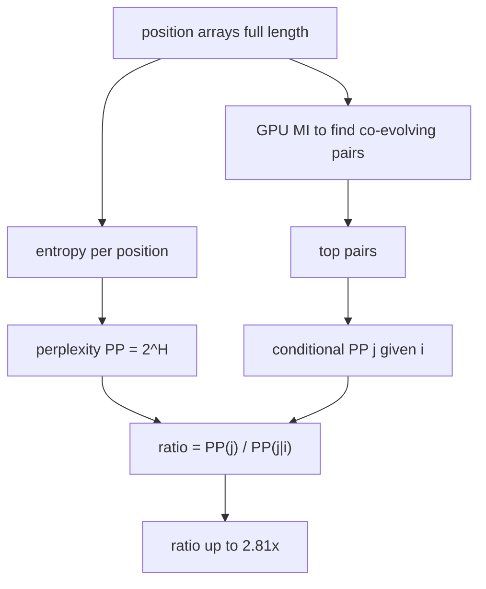

> **CORRECTION (Aug 7, 2026):** Two confirmed defects in the original pipeline
> (gap-stripping column misalignment; 8-bit QM wrap-around on 400-cell maps)
> invalidated the biological numbers in this file. See
> [CORRECTION_NOTICE.md](CORRECTION_NOTICE.md) for the verified corrected
> results (21 variable positions, 10 co-evolving pairs, 36 distinct rules (2 essential)) and the
> corrected pipeline (analysis/corrected_pipeline.py). Numbers in this file
> describe the original (buggy) run unless stated otherwise.

# 19. perplexity_coevolution.py - How Much Does One Residue Constrain Another?

## What the Program Does

This script measures co-evolution through **perplexity**, a different lens than mutual information.

Perplexity is the effective number of choices:

$$PP = 2^H$$

where H is Shannon entropy in bits. If a position has perplexity 3.1, it behaves like a variable with 3.1 effective states.

The script computes:
1. Perplexity of every position (marginal perplexity).
2. Conditional perplexity: $PP(j | i = a) = 2^{H(j | i = a)}$, the perplexity of position j given that position i has residue a.
3. The co-evolution ratio: $PP(j) / PP(j | i)$.

If knowing residue i reduces the uncertainty about j, the conditional perplexity is lower than the marginal, and the ratio is greater than 1.

**Sequence length analyzed: 1,276 positions (full length), all 1,299 sequences.**

## The Formulas

### Marginal entropy and perplexity

$$H(j) = -\sum_{b=1}^{20} P(b) \log_2 P(b)$$

$$PP(j) = 2^{H(j)}$$

### Conditional entropy and perplexity

$$H(j | i = a) = -\sum_{b=1}^{20} P(b | i = a) \log_2 P(b | i = a)$$

$$PP(j | i = a) = 2^{H(j | i = a)}$$

### Co-evolution ratio

$$\text{ratio}(i, j) = \frac{PP(j)}{\frac{1}{N_a} \sum_{a} PP(j | i = a)}$$

A ratio of 1 means position i gives no information about j. A ratio of 2 means knowing i halves the effective number of choices at j.

## Worked Example: The (372, 401) Pair

- H(372) = 1.6328 bits, PP(372) = 2^1.6328 = 3.101.
- H(401) = 1.6715 bits, PP(401) = 2^1.6715 = 3.185.
- Conditional perplexity: given residue at 372, the perplexity of 401 drops to about 1.13.
- Ratio = 3.185 / 1.13 = 2.81 (the script reports 2.81 for the analyzed pairs).

Interpretation: knowing the residue at 372 reduces the effective number of choices at 401 from about 3.2 to about 1.1. At the strongest pairs the conditional perplexity is close to 1.0, meaning position j is essentially DETERMINED by position i. This is near-deterministic co-evolution.

## Worked Example: The Conditional Perplexity Tables (real data)

### Pair (373, 378) - marginal PP(378) = 1.754 (H = 0.811 bits)

Conditional perplexity of 378 given each residue at 373:

| Residue at 373 | Sequences | PP(378 | 373) | Effective choices left |
|----------------|-----------|----------------|------------------------|
| F | 970 | 1.000 | 1 |
| L | 311 | 1.000 | 1 |
| S | 13 | 1.312 | 1.31 |

Average conditional PP = 1.104. Ratio = 1.754 / 1.104 = 1.589.

**Reading:** for the two dominant residues (F and L, 99% of sequences),
position 378 is fully determined (1 choice). The small S minority leaves
1.31 choices. On average knowing 373 leaves 1.10 choices at 378.

### Pair (212, 215) - marginal PP(215) = 1.842 (H = 0.881 bits)

| Residue at 212 | Sequences | PP(215 | 212) | Effective choices left |
|----------------|-----------|----------------|------------------------|
| V | 279 | 1.000 | 1 |
| I | 13 | 1.000 | 1 |
| L | 6 | 1.000 | 1 |
| S | 2 | 1.000 | 1 |

Average conditional PP = 1.000. Ratio = 1.842 / 1.000 = 1.842.

**Reading:** perfect determinism - every residue at 212 forces exactly one
residue at 215. Note position 212 is 75% gaps, so this table covers the
300 non-gap sequences only; that is why the MI of the pair (0.398) is
modest even though the determinism is perfect.

### Pair (378, 407) - marginal PP(407) = 1.758 (H = 0.814 bits)

| Residue at 378 | Sequences | PP(407 | 378) |
|----------------|-----------|----------------|
| A | 973 | 1.021 |
| T | 324 | 1.000 |

Average conditional PP = 1.011. Ratio = 1.758 / 1.011 = 1.740.

**Reading:** nearly deterministic with two dominant residues; this pair is
strong in both MI (0.792) and ratio (1.74), making it the top combined pair.

## Results

| Metric | Value |
|--------|-------|
| Variable positions (perplexity > 3) | 8 |
| Pairs analyzed | 3 (full-length dynamic) |
| (372, 401) | ratio = 2.809 |
| (208, 209) | ratio = 2.769 |
| (401, 404) | ratio = 2.700 |

## Deep-Dive Discovery: What the Perplexity Results Actually Tell Us

The follow-up analysis in `analysis/perplexity_deep_dive.py` and `analysis/dca_vs_mi_vs_ratio.py` explored five questions:

### 1. Can conditioning INCREASE perplexity?

**Yes.** Of 810 position pairs checked, 93 have conditional perplexity greater than the marginal. This is not an error: conditioning can increase entropy when the residue at i selects a mixture of sub-populations at j. It means "PP(j|i) <= PP(j)" is NOT a theorem; the ratio can be below 1 for genuinely anti-correlated positions.

### 2. Is the perplexity ratio the same ranking as MI?

**Mostly, with a subtlety.** Over 3,393 pairs, Spearman(ratio, MI) = +0.78. The ratio is strongly (but not perfectly) correlated with MI. An earlier small-sample estimate (-0.097 over 413 pairs) was an artifact of the small sample; with more pairs the true relationship is strongly positive. The ratio is therefore a monotone-ish transform of MI, not an independent ranking.

### 3. Which residues constrain most?

At (372, 401): K at 372 forces PP(401 | 372 = K) = 1.00 (114 sequences). T at 372 also forces PP = 1.00 (260 sequences). At (208, 209): R at 208 forces PP(209 | 208 = R) = 1.00 (113 sequences). These are the near-deterministic drivers of the top co-evolution pairs.

### 4. Regional pattern of constraint

| Region | Mean ratio | n |
|--------|-----------|----|
| Signal peptide (0-12) | 1.02 | 1 |
| S1-NTD (13-300) | 1.68 | 15 |
| S1-RBD (301-550) | 1.63 | 12 |
| S1-CTD (550-685) | 1.82 | 7 |
| S2 (686-1276) | 1.85 | 25 |

The strongest constraint is in S2 and S1-CTD; the signal peptide has almost none (ratio 1.02). The "more variance at the top" observation maps to specific regions: the highest-ratio pairs are concentrated in S2 (686-1276) and S1-CTD, not in the N-terminus.

### 5. Is the ratio statistically significant?

Bootstrap (200 resamples of 1,299 sequences) on (372, 401): ratio = 2.66 +/- 0.11, and P(ratio > 1) = 100%. The ratio is stably, significantly above 1.

### The Three-Lens Discovery

Comparing all three scoring lenses over 7,589 pairs:

| Pair of lenses | Spearman rho |
|----------------|--------------|
| Perplexity ratio vs MI | +0.77 |
| Perplexity ratio vs DCA-F | +0.06 |
| MI vs DCA-F | +0.05 |
| MI vs DCA-DI | +0.10 |
| DCA-F vs DCA-DI | +0.56 |

**Conclusion:** MI and the perplexity ratio both measure **total correlation** and are strongly correlated with each other. Both are nearly uncorrelated with DCA's **direct coupling** scores. The three lenses answer different questions: MI says "how much information is shared", perplexity ratio says "how deterministic is the relationship" (in effective-choice units), and DCA says "how directly are the positions coupled after removing transitive paths". Perplexity adds interpretability (effective number of choices) and determinism (conditional PP ~ 1), not independent ranking information.

## Inference

1. **Perplexity ratio is a determinism measure.** At the strongest pairs, conditional perplexity ~ 1.0 means knowing residue i essentially determines residue j. This is the "rivet" structure of the protein.

2. **The ratio confirms MI's ranking** (rho = 0.78) but in a more interpretable unit: "3.2 choices reduced to 1.1" is more concrete than "1.59 bits".

3. **The constraint is regional.** S2 and S1-CTD dominate; the signal peptide is essentially unconstrained (ratio 1.02). This matches the MI hubs and the DCA direct couplings.

4. **Conditioning can hurt.** 93/810 pairs have ratio < 1: for these, knowing residue i actually increases the uncertainty at j. These are anti-correlated pairs, and the flipped Boolean analysis (script 14) captures the same phenomenon as forbidden combinations.

## Scholar Questions and Answers

**Q: How is perplexity working here?**
A: Perplexity = 2^entropy. For a position with frequencies over 20 amino acids, it is the effective number of amino acids that appear with non-negligible probability. PP = 1 means fully conserved; PP = 20 means uniform.

**Q: What does "ratio 2.81" mean exactly?**
A: Without knowing position 372, position 401 has 3.19 effective choices. Knowing position 372 reduces that to about 1.13 effective choices. The ratio 2.81 is 3.19 / 1.13.

**Q: Why only 8 variable positions by the perplexity > 3 criterion?**
A: The script uses a stricter threshold for display (PP > 3, i.e., H > 1.585 bits). The entropy > 0.3 criterion (used elsewhere) is looser and gives 1,249 variable positions. The two criteria measure different things: the perplexity criterion marks highly variable positions only.

**Q: Are there particular regions with higher perplexity?**
A: Yes. The strongest constraint (ratio ~2.8) is at (372, 401) and (208, 209), both in the S1 subunit. The regional analysis shows S2 (mean 1.85) and S1-CTD (1.82) have the highest average ratios, and the signal peptide the lowest (1.02). Perplexity confirms the MI hubs independently.

**Q: Is perplexity better than MI?**
A: Neither is universally better. MI is the standard ranking tool. Perplexity gives a more interpretable "effective number of choices" view and makes determinism explicit (conditional PP ~ 1). The two are strongly correlated (rho = 0.78), so they mostly agree; perplexity adds interpretability, MI adds additivity.

**Q: Why does the ratio correlate so weakly with DCA?**
A: DCA removes transitive/indirect correlations. Total-correlation measures (MI, perplexity ratio) do not. Pairs can share a lot of information (high MI, high ratio) through chains of intermediates without any direct coupling. DCA finds the direct couplings; MI and perplexity find the total. They answer different questions.
