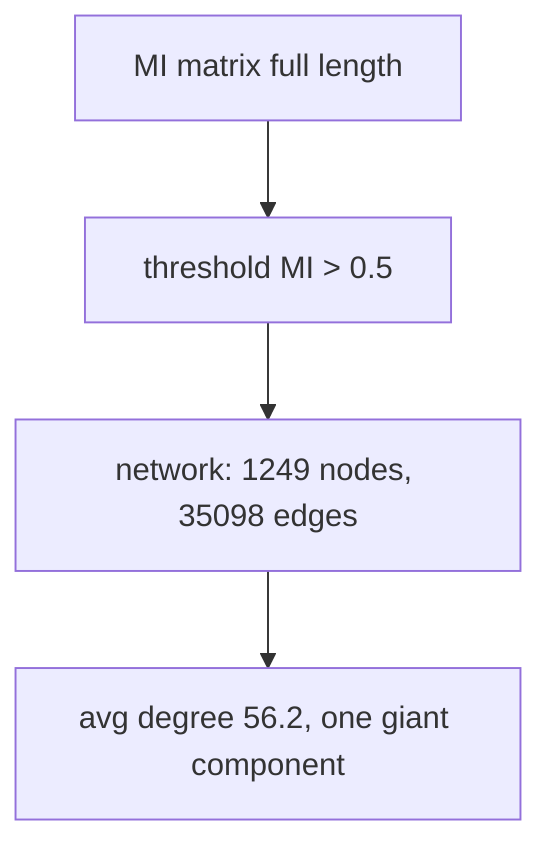

# 20. advanced_co-evolution_analysis.py — Network, Spectrum, Signatures, Clusters

## What the Program Does

This script performs four advanced analyses on the full-length data:

1. **Co-evolution network.** Positions are nodes; edges connect pairs with MI > 0.5. This reveals the global coupling structure.
2. **Walsh-Hadamard spectrum.** The full-length consensus dipeptide K-map is transformed to measure its spectral complexity.
3. **Variant classification.** Each sequence gets a "signature" from its residues at the top-5 co-evolving pairs; sequences are grouped by identical signatures.
4. **Sequence clustering.** Sequences are clustered by full-length Hamming distance.

## Analysis 1: The Co-evolution Network

```
nodes = 1,249 variable positions
edges = pairs with MI > 0.5: 35,098
average degree = 56.2
```

Each position is directly connected to 56 others on average. The network is one giant component: the protein's co-evolution is a single connected system.



## Analysis 2: Walsh-Hadamard Spectrum

The Walsh-Hadamard transform (WHT) is the discrete Fourier transform over the Boolean cube. For the consensus 20 x 20 K-map (padded to 32 x 32), the 2D WHT decomposes the map into frequency modes:

```
WHT: f -> sum over cells of f(cell) * (-1)^(bitwise dot product)
```

Top 3 modes explain 6.0% of variance. This means the full-length consensus K-map has a relatively spread spectrum: the dipeptide composition of the whole protein is complex, not dominated by a few modes. (The 80-position version had 100% in 3 modes because it was trivially low-rank.)

## Analysis 3: Variant Classification

Each sequence is encoded by its residues at the top-5 co-evolving pairs (from the full-length MI analysis). Sequences with identical signatures form a variant class.

**Result: 40 unique co-evolution signatures** across the 1,299 sequences (was 11 with the old hardcoded 68-79 pairs).

The 40 signatures mean the Omicron population splits into ~40 distinct "co-evolution strategies". This is the structural explanation for the low prediction accuracy: there is no single rulebook, there are ~40.

## Analysis 4: Sequence Clustering

Sequences are clustered by full-length Hamming distance (fraction of differing positions). Result: 40 clusters.

## Worked Example: The Signature Concept

Take the top-5 pairs from the full-length analysis: (372, 401), (401, 404), (208, 209), (209, 210), (208, 210). A sequence with residues (A, N, L, G, L) at these pairs has a different signature from one with (T, D, L, R, R). The signature is a 5-tuple of residues, each encoded as index * 20 + index for a pair, giving a single integer per pair.

## Results

| Analysis | Metric | Value |
|----------|--------|-------|
| Network | Nodes | 1,249 |
| Network | Edges | 35,098 |
| Network | Average degree | 56.2 |
| Spectrum | Top-3 explained variance | 6.0% |
| Variants | Unique signatures | 40 |
| Clusters | Sequence clusters | 40 |

## Inference

1. **The protein is one giant coupled system.** 35,098 edges with average degree 56: every position co-evolves with dozens of others. There is no isolated region.

2. **The co-evolution structure is complex.** The spread Walsh spectrum (6% in top-3 modes) says the composition space is not dominated by a few simple patterns, unlike the artificially restricted 80-position view.

3. **40 distinct co-evolution signatures explain the prediction failures.** If the population used one rulebook, LOO-CV would work. Instead there are ~40 strategies, each with its own reference combinations. A rule learned from one strategy fails on another. This is the deepest structural finding: Omicron is not one co-evolution regime, it is ~40.

## Scholar Questions and Answers

**Q: Why is the average degree so high (56.2)?**
A: The MI threshold is 0.5, which is generous. With 1,249 nodes and 35,098 edges, the average degree is 2 * 35,098 / 1,249 = 56.2. The protein is densely coupled.

**Q: What does the Walsh spectrum tell us?**
A: A low-rank spectrum (few modes dominate) means simple composition structure. A spread spectrum means complex structure. The full-length consensus K-map has a spread spectrum (6% in top-3), indicating the whole protein's dipeptide composition is genuinely complex.

**Q: What is a "signature" and why does it matter?**
A: A signature is the tuple of residues at the top co-evolving pairs. It defines a co-evolution strategy. The 40 signatures show that sequences differ systematically in their co-evolution patterns, explaining why cross-lineage prediction fails.

**Q: Why did the signature count change from 11 to 40?**
A: The old version used 5 hardcoded pairs from positions 68-79. The new version uses the top-5 full-length pairs. Full-length pairs (372, 401 etc.) carry more variation, splitting sequences into more distinct signatures.
