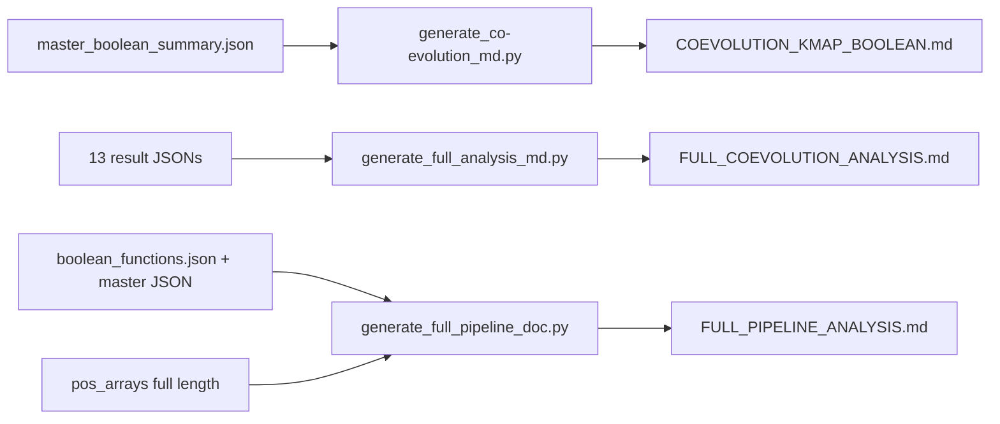

# 21. Report Generators — The Three Documentation Scripts

## What These Programs Do

Three scripts convert the JSON results into human-readable reports:

1. `generate_co-evolution_md.py` - produces `kmap_boolean_coevolution/COEVOLUTION_KMAP_BOOLEAN.md` (all Boolean rules with LaTeX expressions).
2. `generate_full_analysis_md.py` - produces `FULL_COEVOLUTION_ANALYSIS.md` (aggregate of all JSON results).
3. `generate_full_pipeline_doc.py` - produces `FULL_PIPELINE_ANALYSIS.md` (the comprehensive pipeline document with formulas, tables, and all 152 rules).

None of these compute new statistics. They read the result JSON files and render them into markdown with LaTeX math and tables.

## Data Flow

## What the Reports Contain

### COEVOLUTION_KMAP_BOOLEAN.md (1,138 lines)

For each of the 15 rule pairs:
- K-map compact view (on-set residue pairs).
- Boolean function in LaTeX (e.g., `~s3 & s2 & s1 & ~s0 & t3 & ~t2 & t1 & t0`).
- Natural-language rules.
- Coupling tables.

### FULL_COEVOLUTION_ANALYSIS.md (342 lines)

- Dataset description.
- H1 result.
- K-map summaries (binary and n-ary).
- Position-level co-evolution, coupling, network, mutations.
- Failed-algorithm analysis (LOO-CV, DCA, flipped).

### FULL_PIPELINE_ANALYSIS.md (52 KB)

The comprehensive document:
- 236 Lean theorem catalog.
- Full dataset description.
- K-map construction formulas.
- All 152 Boolean expressions.
- Entropy table (full length), MI top-50, coupling constants, perplexity.
- H1 results.
- Script inventory.

## Worked Example: A Rule in the Report

The rule `IF pos 413 = W AND pos 427 = E THEN co-evolutionary` appears in all three reports. In COEVOLUTION_KMAP_BOOLEAN.md it is rendered with its 8-bit Boolean expression; in FULL_PIPELINE_ANALYSIS.md it appears in the "Complete Inference Rules" section with its position pair table; in FULL_COEVOLUTION_ANALYSIS.md it is summarized in the "108... 152 essential prime implicants" count.

## Key Verified Numbers in the Reports

| Metric | Value |
|--------|-------|
| Essential prime implicants | 152 |
| Position pairs with rules | 15 |
| Max MI (full length) | 1.5917 at (372, 401) |
| Lean theorems cataloged | 236 |
| Scripts inventoried | 22 |

## Scholar Questions and Answers

**Q: Why regenerate the reports after every analysis change?**
A: The reports are derived documents. When a bug is fixed or an analysis is re-run, the JSONs change and the reports must be regenerated to stay truthful. This project re-runs the three generators after every result change.

**Q: What is the difference between the three reports?**
A: COEVOLUTION_KMAP_BOOLEAN.md is rules-focused. FULL_COEVOLUTION_ANALYSIS.md is a summary of all results. FULL_PIPELINE_ANALYSIS.md is the complete pipeline document with formulas and the Lean theorem catalog.

**Q: Do the reports add any computation?**
A: generate_full_pipeline_doc.py recomputes some metrics (entropy, MI pairs, coupling) from the position arrays to verify the stored JSONs. The other two only render stored results. The recomputation is a consistency check: the printed numbers match the stored ones.
