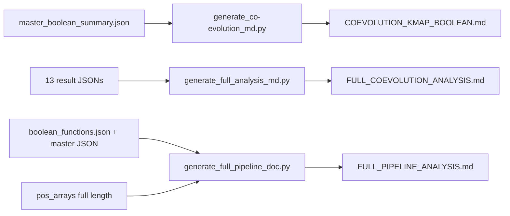

> **CORRECTION (Aug 7, 2026):** The MI values in this file come from the
> original gap-stripped (misaligned) pipeline. The DCA algorithm itself is
> unaffected (it uses the raw alignment), but the DCA-vs-MI comparison must
> be re-interpreted against the corrected MI (max 0.807 at (373,378)).
> See [CORRECTION_NOTICE.md](CORRECTION_NOTICE.md).

# 21. Report Generators - The Three Documentation Scripts

## What These Programs Do

Three scripts convert the JSON results into human-readable reports:

1. `generate_co-evolution_md.py` - produces `kmap_boolean_coevolution/COEVOLUTION_KMAP_BOOLEAN.md` (all Boolean rules with LaTeX expressions).
2. `generate_full_analysis_md.py` - produces `FULL_COEVOLUTION_ANALYSIS.md` (aggregate of all JSON results).
3. `generate_full_pipeline_doc.py` - produces `FULL_PIPELINE_ANALYSIS.md` (the comprehensive pipeline document with formulas, tables, full length (1,276 positions), and all 36 rules).

None of these compute new statistics. They read the result JSON files and render them into markdown with LaTeX math and tables.

## Data Flow

## What the Reports Contain

### COEVOLUTION_KMAP_BOOLEAN.md (588 lines, corrected Aug 7)

For each of the 10 rule pairs:
- K-map compact view (on-set residue pairs).
- Boolean function as residue-pair conditions (5-bit variables per axis, FIX A2).
- Natural-language rules.
- Coupling tables.

### FULL_COEVOLUTION_ANALYSIS.md (341 lines)

- Dataset description.
- H1 result.
- K-map summaries (binary and n-ary).
- Position-level co-evolution, coupling, network, mutations.
- Failed-algorithm analysis (LOO-CV, DCA, flipped).

### FULL_PIPELINE_ANALYSIS.md (52 KB)

The comprehensive document:
- 236 Lean theorem catalog.
- Full dataset description.
- K-map construction formulas.
- All 36 Boolean expressions.
- Entropy table (full length), MI top-50, coupling constants, perplexity.
- H1 results.
- Script inventory.

## Worked Example: A Rule in the Report

The rule `IF pos 212 = G AND pos 216 = R THEN co-evolutionary` (one of the 2 essential rules) appears in COEVOLUTION_KMAP_BOOLEAN.md rendered with its 5-bit Boolean expression; the FULL_PIPELINE_ANALYSIS.md and FULL_COEVOLUTION_ANALYSIS.md contain the "Complete Inference Rules" sections.

## Key Verified Numbers in the Reports

| Metric | Value |
|--------|-------|
| Distinct prime implicants (rules) | 36 (2 essential) |
| Position pairs with rules | 10 |
| Max full-MI (corrected) | 0.8067 at (373, 378) |
| Max mutation-only MI (corrected) | 0.8710 at (495, 498) |
| Lean theorems cataloged | 236 |
| Scripts inventoried | 22 |

## Inference

The reports are derived documents: they are only as good as the JSONs they render. The inference is that reproducible science requires regenerating reports after every analysis change, and the three reports serve three audiences: rules-focused, summary-focused, and complete-pipeline documentation.

## Scholar Questions and Answers

**Q: Why regenerate the reports after every analysis change?**
A: The reports are derived documents. When a bug is fixed or an analysis is re-run, the JSONs change and the reports must be regenerated to stay truthful. This project re-runs the three generators after every result change.

**Q: What is the difference between the three reports?**
A: COEVOLUTION_KMAP_BOOLEAN.md is rules-focused. FULL_COEVOLUTION_ANALYSIS.md is a summary of all results. FULL_PIPELINE_ANALYSIS.md is the complete pipeline document with formulas and the Lean theorem catalog.

**Q: Do the reports add any computation?**
A: generate_full_pipeline_doc.py recomputes some metrics (entropy, MI pairs, coupling) from the position arrays to verify the stored JSONs. The other two only render stored results. The recomputation is a consistency check: the printed numbers match the stored ones.
