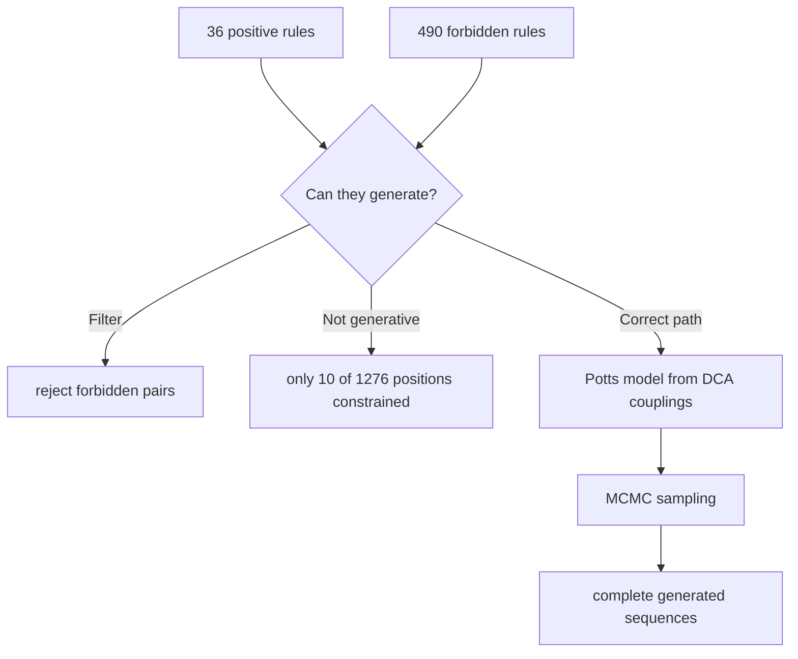

> **CORRECTION (Aug 7, 2026):** Two confirmed defects in the original pipeline
> (gap-stripping column misalignment; 8-bit QM wrap-around on 400-cell maps)
> invalidated the biological numbers in this file. See
> [CORRECTION_NOTICE.md](CORRECTION_NOTICE.md) for the verified corrected
> results (21 variable positions, 10 co-evolving pairs, 36 distinct rules (2 essential)) and the
> corrected pipeline (analysis/corrected_pipeline.py). Numbers in this file
> describe the original (buggy) run unless stated otherwise.

# 22. The 36 Rules: Can They Generate New Omicron Sequences?

## The Question

The master Boolean function produced 36 distinct rules (2 essential) from the Omicron dataset. The natural question: **can these rules be applied to generate a new, valid Omicron sequence?**

The short answer: **partially, as a constraint filter, but not as a generative model.**

## What the 36 Rules Actually Are

The rules are of two kinds:

```
Positive rules (master_boolean):  IF pos i = X AND pos j = Y THEN co-evolutionary
Forbidden rules (flipped):         IF pos i = X AND pos j = Y THEN FORBIDDEN
```

The 36 positive rules say which residue combinations at the 10 rule pairs are CONSISTENT with Omicron evolution. The 490 forbidden rules say which combinations have NEVER been observed.

## Using the Rules as a Filter

A candidate new sequence can be checked against the rules:

1. Encode the sequence with He 2012.
2. For each of the 10 rule pairs (i, j), read the residues (a, b).
3. Check the forbidden list: if (a, b) matches a forbidden rule, the sequence is predicted UNFIT.
4. Check the positive list: if (a, b) matches no positive rule and no forbidden rule, the combination is unclassified (observed or not in this dataset).

This makes the rules a **necessary-condition filter**: a valid Omicron-like sequence must not contain any forbidden pair. But the rules do not specify the residues at the other 1,261 positions, nor the exact residue at every rule position.

## Why the Rules Are NOT a Generative Model

A generative model would produce a complete sequence. The rules are incomplete in three ways:

1. **Coverage.** Only 10 position pairs have rules. The other positions are unconstrained by the rules. Two sequences can satisfy all 36 rules and still differ at thousands of positions.

2. **Choice.** The positive rules list several allowed partners for a given residue (e.g., position 212 = V allows partners E, K at position 216). The rules do not say WHICH one to pick.

3. **Non-transitivity.** The rules are pairwise. A sequence satisfying every pairwise rule can still violate a three-body constraint that evolution respects. Pairwise rules cannot capture higher-order coupling.

## The Empirical Evidence: Why Generation Fails

The prediction results quantify the limitation:

| Method | Accuracy | Meaning |
|--------|----------|---------|
| LOO-CV (constraint function) | 9.24% | Given a mutation at i, the predicted partner at j matches reality only 9.24% of the time (301/3259) |
| Train/test (constraint function) | 0.11% | Same, different split |
| Local precision | 17.6% | Best, but still low |

If the 36 rules could generate valid sequences, the prediction accuracy would be high. It is not. The reason is the 40 distinct co-evolution signatures (script 20): the population uses ~40 different rulebooks. A rule set learned from all sequences is an average over strategies, and an average rulebook fits none of them perfectly.

## Worked Example: Checking a Candidate Sequence

Take a hypothetical sequence with:
- Position 212 = V (matches the reference)
- Position 216 = R (matches the reference)

The pair (212, 216) = (V, R) is the reference and passes all rules.

Now change position 212 to G and position 216 to R. The pair (G, R) matches an essential rule. The filter accepts this combination.

Now change 212 to W and 216 to G. The pair (W, G) is unclassified (never observed in this dataset, not listed as forbidden either). The filter neither accepts nor rejects it - it is outside the learned grammar.

The filter is therefore a valid **sanity check** for mutations: it separates "combinations evolution has used" from "combinations evolution has never used". For protein design, this is valuable: the forbidden rules are candidate lethal pairs.

## Inference

### The Correct Use of the Rules

1. **Mutation screening.** Given a proposed mutation at position i, check whether the partner position j would form a forbidden pair. If yes, the mutation is predicted deleterious.
2. **Consistency checking.** Verify that a candidate sequence contains no forbidden pairs.
3. **Rule-based description.** Use the rules to describe the co-evolution grammar of Omicron.

The rules are NOT for:
1. Generating full sequences from scratch.
2. Predicting which mutation occurs next (that is probabilistic; 9.24% LOO-CV).
3. Modeling beyond pairwise constraints.

## How One WOULD Build a Generative Model

If generation were the goal, the correct approach is a Potts model (which is what DCA approximates):

```
P(sequence) proportional to exp( sum over i of h_i(a_i) + sum over i<j of J_ij(a_i, a_j) )
```

Sampling from this distribution (e.g., with MCMC) generates complete sequences that respect all pairwise couplings. The 36 Boolean rules are a coarse, thresholded version of the Potts couplings. The DCA couplings (script 18) are the continuous version. Converting the rules into a full Potts model is the path to true generation.

## Scholar Questions and Answers

**Q: Can the 36 rules make a new Omicron sequence?**
A: No, not by themselves. They constrain 10 position pairs. A complete sequence needs 1,276 positions. The rules can filter candidate sequences (reject forbidden pairs) but cannot generate the unconstrained positions.

**Q: Can the rules at least validate a new sequence?**
A: Yes, partially. A sequence containing any forbidden pair is predicted unfit. A sequence passing all rules is "consistent with observed Omicron co-evolution" at the 10 rule pairs, but consistency is not validation: many consistent sequences are still unlikely.

**Q: Why is prediction accuracy so low if the rules are correct?**
A: The rules are correct descriptions of PAST co-evolution. Prediction requires knowing which of several allowed partners evolution will pick. That choice is lineage-specific and probabilistic, hence 9.24-17.6% accuracy.

**Q: What would make generation work?**
A: A Potts model with the full pairwise couplings (from DCA), sampled by MCMC. The Boolean rules are the thresholded version; DCA gives the continuous couplings. This is the natural next step.

**Q: Are the forbidden rules more useful than the positive rules for design?**
A: Yes. Negative constraints ("you cannot use X-Y") are stronger than positive ones ("you must use X-Y"). The 490 forbidden rules define the boundary of the sampled fitness landscape and are directly usable as mutation-screening filters.

## Mermaid Diagram


