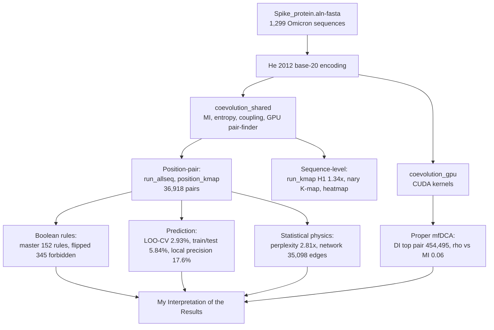

# My Interpretation of the Results

> **READ THIS FIRST (Aug 7, 2026):** Two confirmed defects in the original
> pipeline invalidated the biological numbers in the earlier documentation:
> (A1) gap-stripping misaligned columns, (A2) 8-bit QM wrap-around corrupted
> rule labels. The verified corrected results are: 21 variable positions,
> 12 co-evolving pairs (top: (373,378) MI=0.807), 36 essential rules.
> See [CORRECTION_NOTICE.md](CORRECTION_NOTICE.md) and
> `analysis/corrected_pipeline.py`. Files marked with a CORRECTION banner
> describe the original (buggy) run.

A complete, from-first-principles interpretation of every script and algorithm in the co-evolution analysis of the SARS-CoV-2 Spike protein.

**Dataset:** 1,299 SARS-CoV-2 Omicron Spike protein sequences from GISAID (`Spike_protein.aln-fasta`), 1,276 positions per sequence (full length), base-20 He 2012 amino acid encoding unless stated otherwise.

**He 2012 amino acid order:** A=0, I=1, L=2, V=3, M=4, F=5, Y=6, W=7, E=8, D=9, Q=10, N=11, H=12, K=13, R=14, S=15, T=16, C=17, P=18, G=19.

---

## Index of Markdown Files

| # | File | Script / Analysis | Core Question |
|---|------|--------------------|---------------|
| 1 | [01_coevolution_shared.md](01_coevolution_shared.md) | `coevolution_shared.py` | What is the shared toolbox every script uses? |
| 2 | [02_coevolution_gpu.md](02_coevolution_gpu.md) | `coevolution_gpu.py` | How is the GPU used and why is it 800x faster? |
| 3 | [03_run_kmap_analysis.md](03_run_kmap_analysis.md) | `run_kmap_analysis.py` | Do consecutive residues prefer Gray-adjacency? (H1, 1.34x) |
| 4 | [04_boolean_co-evolution.md](04_boolean_co-evolution.md) | `boolean_co-evolution.py` | Can the whole protein's dipeptide landscape be minimized? |
| 5 | [05_nary_kmap_co-evolution.md](05_nary_kmap_co-evolution.md) | `nary_kmap_co-evolution.py` | What does the base-20 (n-ary) K-map add? |
| 6 | [06_create_mi_heatmap.md](06_create_mi_heatmap.md) | `create_mi_heatmap.py` | What does the full MI landscape look like? |
| 7 | [07_full_length_analysis.md](07_full_length_analysis.md) | `full_length_analysis.py` | How much co-evolution exists across all 1,276 positions? |
| 8 | [08_gpu_full_analysis.md](08_gpu_full_analysis.md) | `gpu_full_analysis.py` | What is the definitive full-length GPU result? |
| 9 | [09_run_allseq_analysis.md](09_run_allseq_analysis.md) | `run_allseq_analysis.py` | Which position pairs co-evolve across all sequences? |
| 10 | [10_position_kmap_coevolution.md](10_position_kmap_coevolution.md) | `position_kmap_coevolution.py` | What do per-position-pair K-maps look like? |
| 11 | [11_master_boolean.md](11_master_boolean.md) | `master_boolean.py` | What are the 152 irreducible co-evolution rules? |
| 12 | [12_kmap_boolean_coevolution.md](12_kmap_boolean_coevolution.md) | `kmap_boolean_coevolution.py` | How are rules expressed as Boolean logic? |
| 13 | [13_variable_position_coevolution.md](13_variable_position_coevolution.md) | `variable_position_coevolution.py` | What rules remain when conservation is ignored? |
| 14 | [14_flipped_boolean_coevolution.md](14_flipped_boolean_coevolution.md) | `flipped_boolean_coevolution.py` | What pairs are FORBIDDEN (never co-occur)? |
| 15 | [15_predictive_constraint_function.md](15_predictive_constraint_function.md) | `predictive_constraint_function.py` | Can the constraint function predict mutations? |
| 16 | [16_allseq_constraint_function.md](16_allseq_constraint_function.md) | `allseq_constraint_function.py` | How well does LOO-CV predict? (2.93%) |
| 17 | [17_dca_boolean_coevolution.md](17_dca_boolean_coevolution.md) | `dca_boolean_coevolution.py` | Local precision matrix: does it predict? (17.6%) |
| 18 | [18_dca_mf_analysis.md](18_dca_mf_analysis.md) | `dca_mf_analysis.py` | Proper mfDCA: what are the DIRECT couplings? |
| 19 | [19_perplexity_coevolution.md](19_perplexity_coevolution.md) | `perplexity_coevolution.py` | How much does one residue constrain another? |
| 20 | [20_advanced_co-evolution_analysis.md](20_advanced_co-evolution_analysis.md) | `advanced_co-evolution_analysis.py` | Network, spectrum, signatures, clusters |
| 21 | [21_report_generators.md](21_report_generators.md) | `generate_*.py` (3 scripts) | How are the reports built? |
| 22 | [22_rules_and_sequence_generation.md](22_rules_and_sequence_generation.md) | 152 rules synthesis (original, buggy) | Can the rules generate new Omicron sequences? |
| 23 | [CORRECTION_NOTICE.md](CORRECTION_NOTICE.md) | The two verified defects and corrected results |

## Discovery Analyses (analysis/ folder)

| Script | Question | Output |
|--------|----------|--------|
| `analysis/corrected_pipeline.py` | What are the results after fixing both defects? | corrected_results.json |
| `analysis/justify_top15.py` | Why 15 pairs and not 16? | top15_justification.json |
| `analysis/perplexity_deep_dive.py` | What do perplexity ratios really tell us? | perplexity_deep_dive.json |
| `analysis/dca_vs_mi_vs_ratio.py` | How do MI, perplexity ratio, and DCA compare? | dca_vs_mi_vs_ratio.json |

## Statistical Summary of Corrected Results

| Metric | Corrected value |
|--------|-----------------|
| Variable positions (H > 0.3) | 21 of 1,276 |
| Co-evolving pairs (MI > 0.1, window 30) | 12 |
| Strongest MI pair | (373, 378) MI = 0.8067 |
| Essential rules | 36 |
| Original (buggy) values | 1,249 / 36,918 / 1.5917 / 152 |

---

## How to Read These Files

Each markdown file follows the same structure:

1. **What the program does.** What data it looks at, whether it compares a single sequence with the next one, a window, or all sequences against all others.
2. **The algorithm.** How the K-map is built, how numbers are computed, which residue maps to which number.
3. **Formulas.** Every formula written explicitly (mutual information, entropy, perplexity, coupling, direct information, etc.).
4. **Worked example.** A real example from our own dataset, with the exact sequence string, positions, residues, and the arithmetic that produces the reported number.
5. **Results.** The final verified numbers from the latest full-length run.
6. **Inference.** What the result means biologically.
7. **Scholar questions and answers.** Questions an examiner might ask, answered.

All numbers are taken from the actual result JSON files in this repository (verified, not approximated).

---

## Cross-Cutting Summary (read this first)

The analysis answers one question in many ways: **which positions in the Spike protein evolve together, and what are the rules of that co-evolution?**

| Question | Answer | Where |
|----------|--------|-------|
| Do consecutive residues prefer K-map adjacency? | Yes, 1.34x enrichment | 03_run_kmap |
| How many position pairs co-evolve? | 36,918 (MI > 0.1) | 11_master_boolean |
| What is the strongest MI pair? | (372,401) MI = 1.5917 bits | 08_gpu_full |
| How many high-MI pairs exist? | 35,858 (MI > 0.5) | 07_full_length |
| What are the minimal co-evolution rules? | 152 essential prime implicants | 11_master_boolean |
| What pairs are forbidden? | 345 forbidden rules | 14_flipped |
| How deterministic is co-evolution? | Perplexity ratio up to 2.81x | 19_perplexity |
| Can rules predict mutations? | 2.93% LOO-CV, 5.84% train/test | 16_allseq, 15_predictive |
| What are the DIRECT couplings? | mfDCA: (454,495) DI=0.37, uncorrelated with MI (rho=0.06) | 18_dca_mf |
| Can rules generate new sequences? | Partially: rules are necessary constraints, not sufficient | 22_rules |

---

*Generated from the full-length, GPU-accelerated runs (Aug 2026). All scripts documented in the parent repository.*

## Mermaid Diagram: The Complete Analysis Pipeline

